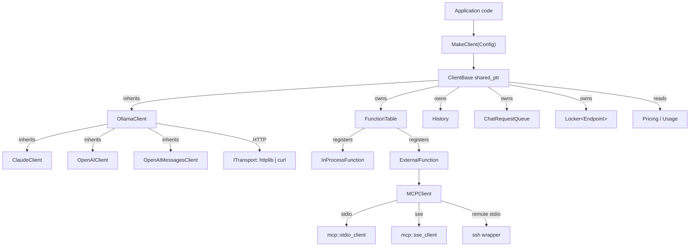
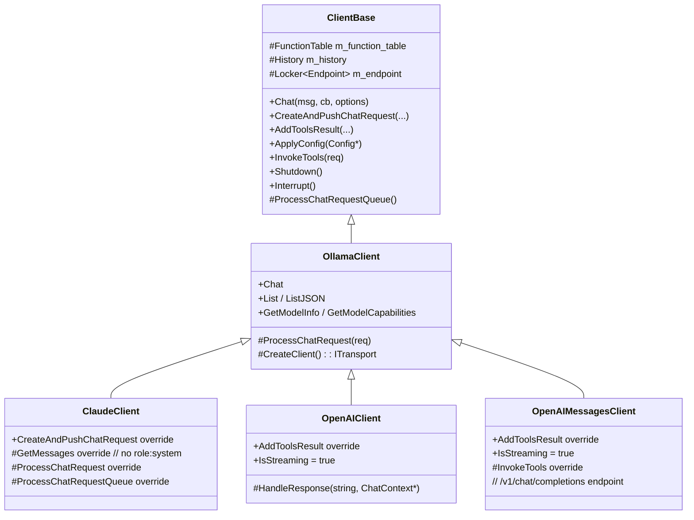
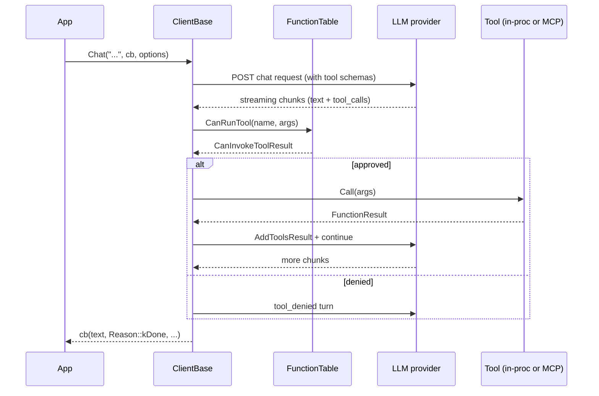

# Architecture

<!-- meta:purpose=system architecture and design patterns -->
<!-- meta:audience=ai-assistants,architects -->

## High-level shape

`assistant` is a header-rich C++20 static library that abstracts over multiple LLM providers behind a single `ClientBase` interface. Applications obtain a `std::shared_ptr<ClientBase>` from the `MakeClient(...)` factory in `assistant/assistant.hpp` and drive chats, tools, and history through it. The same library binds external tools through the **Model Context Protocol (MCP)** — both stdio and SSE transports, including remote MCP servers tunnelled over SSH.

## Layering

```mermaid
flowchart LR
  subgraph L0[Vendored single-header deps]
    JSON[nlohmann/json]
    HTTPLIB[cpp-httplib]
    Base64[Base64]
    MagicEnum[magic_enum]
  end

  subgraph L1[Foundation]
    Logger[logger.hpp]
    Common[common.hpp]
    Helpers[helpers.hpp]
    Attr[attributes.hpp]
    Notifier[thread_notifier.hpp]
    Process[Process.hpp]
    Curl[Curl.hpp]
  end

  subgraph L2[Core types]
    Lib[assistantlib.hpp: message, request, response, ITransport]
    Function[function.hpp]
    Config[config.hpp]
    Env[EnvExpander.hpp]
    MCP[mcp.hpp]
    Tool[tool.hpp]
    Parsers[*_response_parser.hpp]
  end

  subgraph L3[Clients]
    Base[client_base.hpp/cpp]
    Ollama[ollama_client]
    Claude[claude_client]
    OpenAI[openai_client]
    OpenAIMsg[openai_messages_client]
  end

  subgraph L4[Public umbrella]
    UmbrellaApi[assistant.hpp: MakeClient]
  end

  subgraph CppMcp[cpp-mcp/ static library mcp-cpp]
    McpClient[mcp::client]
    McpTool[mcp::tool]
    McpServer[mcp::server]
    McpStdio[mcp::stdio_client]
    McpSse[mcp::sse_client]
  end

  L0 --> L1
  L1 --> L2
  L2 --> L3
  L3 --> L4
  L2 --> CppMcp
```

## Inheritance: the client family

`OllamaClient` is the only direct subclass of `ClientBase`; the OpenAI and Claude clients are derived from `OllamaClient` and override only the parts of the request/response lifecycle that differ.

Why this shape: Ollama's request/response wire format is the closest to a "neutral" baseline — chat messages with `role/content` and `tool_calls`. Claude and OpenAI override only what their wire formats demand (separate system message, different tool-result encoding, different streaming framing).

## Concurrency model

The library is designed for a single application thread that drives `Chat()` while a background worker (an `assistant::ThreadNotifier`-style condition variable + queue) handles the network round-trip and streaming callbacks.

Concurrency primitives in use:

- `std::mutex` + `GUARDED_BY(...)` annotations from `assistant/attributes.hpp` (Clang thread-safety analysis is enabled repo-wide).
- `assistant::Locker<T>` (`common.hpp`) — exposes `with_mut`/`with`/`get_value`/`set_value` to enforce that callers always hold the lock when touching `T`.
- `assistant::ThreadNotifier<Value>` (`thread_notifier.hpp`) — a condvar-backed value slot used to deliver one-shot results between threads with a timeout.
- `std::atomic_bool m_interrupt` on `ClientBase` for cooperative cancellation.
- `ChatRequestQueue` (in `client_base.hpp`) — internally a `std::vector` guarded by a `std::mutex`.
- `History` (in `client_base.hpp`) — guards the active message vector with a mutex; supports nested `SwapToTempHistory`/`SwapToMainHistory`.

## Transport

The library defines `assistant::ITransport` (in `assistantlib.hpp`) as the seam between client logic and HTTP. Two implementations exist:

| Transport | Selected by | Implementation |
|---|---|---|
| `TransportType::httplib` (default) | Implicitly created by `OllamaClient::CreateClient()` | The vendored `cpp-httplib` (`assistant/common/httplib.h`) |
| `TransportType::curl` | Explicit `client->SetTransportType(TransportType::curl)` or config | `assistant::Curl` (`assistant/Curl.cpp`) — invokes the system `curl` binary as a subprocess |

The curl transport exists for environments where httplib's TLS or proxy support is insufficient; it serialises requests to disk and shells out to `curl`, so it costs more per request but gains proxy/CA fidelity.

## Configuration model

Configuration is JSON-driven and parsed by `assistant::ConfigBuilder` (see `data_models.md`). The parser performs two-stage processing:

1. `EnvExpander` expands `${VAR}` and `$VAR` references in every string in the config tree, before structural validation, against an optional `EnvMap` overlay or the system environment.
2. `ConfigBuilder` validates structure, ensures exactly one **active** endpoint, and defaults missing fields.

`MakeClient(Config)` selects a concrete client class by `Endpoint::type_` (an `EndpointKind` enum) and then calls `ApplyConfig(Config*)` so the client can pull MCP servers, log level, timeouts, and other shared knobs.

## Tool / function calling

`FunctionBase` is endpoint-aware: its `ToJSON(EndpointKind)` produces the wire-format-specific tool schema (`function`/`name`/`parameters` for Ollama and Moonshot, flat `name/parameters/strict` for OpenAI's `/v1/responses`, and `name/input_schema` for Claude). The `FunctionTable` then assembles a per-request tool list, optionally tagging the last tool with `cache_control: {type: "ephemeral"}` for Anthropic when `CachePolicy::kStatic` is selected.

Tools come in two flavours:

- `InProcessFunction` — a C++ callback registered with `FunctionBuilder`. Has an optional per-tool `OnToolInvokeCallback` for human-in-the-loop approval that overrides the client-wide one.
- `ExternalFunction` — wraps a single `mcp::tool` from an `MCPClient`. Calls are forwarded over the live MCP transport.

## Cancellation, max tokens, and continuation

`ClientBase::Interrupt()` flips an atomic that the active client's stream loop polls between chunks; the in-flight transport (httplib or curl) is also asked to abort. The CLI demo demonstrates max-token continuation: when the response callback receives `Reason::kMaxTokensReached`, the demo re-issues "Please continue from exactly where you left off." automatically.

## Repository organization rationale

- `assistant/common/` — vendored single-header dependencies live next to the code that uses them, so build-system changes are local.
- `assistant/cpp-mcp/` — built as its own static library (`mcp-cpp`) and linked into `assistantlib`, so the protocol can be reused independently if needed.
- `cli/` is gated by `ASSISTANTLIB_BUILD_EXAMPLE` — defaulting `ON` keeps it visible, but library consumers can disable it with one CMake flag.
- `tests/` is gated by `ASSISTANTLIB_BUILD_TESTS` (or `ENABLE_TESTS`) — defaulting `OFF` prevents a `find_package(GTest)`-free consumer from accidentally pulling the submodule into its own build.
