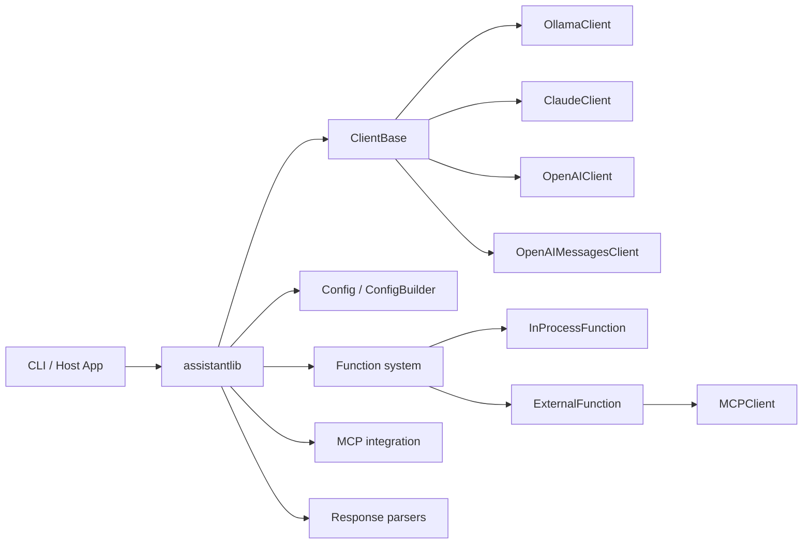
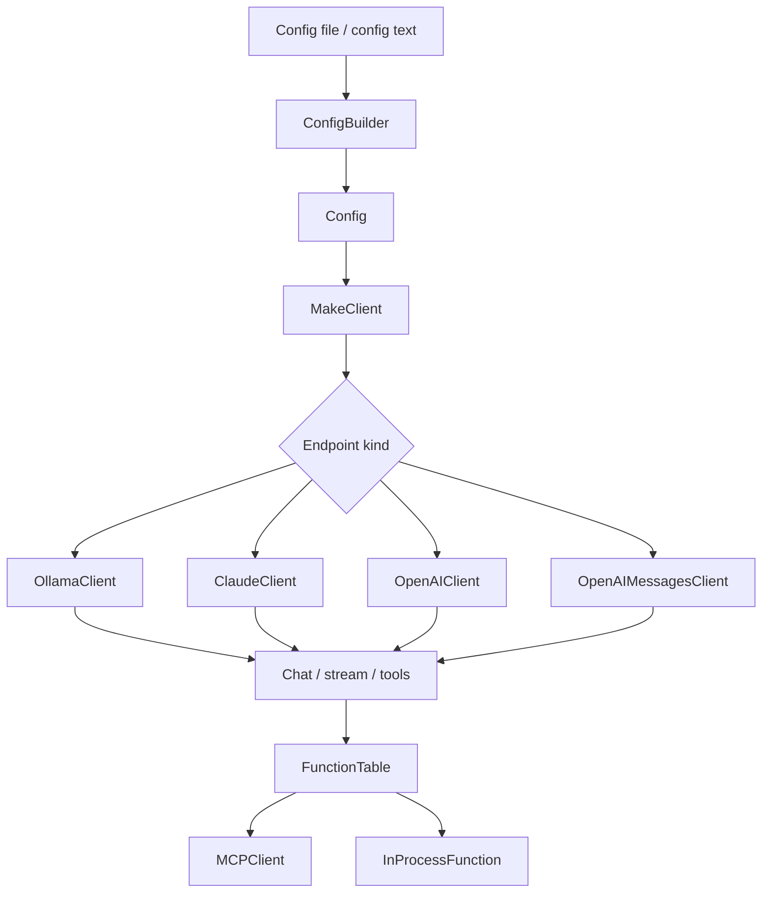

# Architecture

## System overview
The repository implements a C++20 AI assistant library with a unified client abstraction over multiple model providers. The main architectural choice is a provider-neutral `ClientBase` interface with concrete provider clients for Ollama, Anthropic Claude, OpenAI, and OpenAI-compatible messages endpoints.

## Architectural boundaries

## Design patterns observed
- **Strategy-like provider selection**: `MakeClient(...)` chooses a concrete client based on endpoint type.
- **Facade**: `ClientBase` presents a consistent interface for chat, history, tools, and configuration.
- **Builder**: `FunctionBuilder` constructs tool definitions fluently.
- **RAII cleanup**: `ChatRequestFinaliser` triggers finalization when request scope ends.
- **Thread-safe state containers**: history and request queues use locking for shared mutable state.

## Core subsystems
1. **Configuration subsystem**
   - Parses endpoint settings, logging, timeout values, and MCP server definitions.
   - Expands environment variables in configuration values.
2. **Client subsystem**
   - Provider implementations handle request/response formatting and transport details.
3. **Tooling subsystem**
   - In-process functions and MCP-backed external functions share a common abstraction.
4. **Protocol subsystem**
   - Response parsers normalize provider-specific streaming and completion payloads.
5. **MCP subsystem**
   - Supports STDIO and SSE transports, including SSH-backed remote STDIO use cases.

## Notable runtime characteristics
- Streaming callbacks are central to response delivery.
- History is managed as a bounded window and is modified during chat flows.
- Tool invocation can be gated by a human-in-the-loop approval callback.
- TLS support is conditional at build time.

## Mermaid structural view

## Constraints and deviations
- The codebase uses a mix of provider-specific response formats; parsing is a key compatibility layer.
- Some configuration defaults are embedded in code, so documentation should avoid claiming all defaults come from config files.
- The repository includes a third-party vendored GoogleTest tree; it is outside the core architecture.
