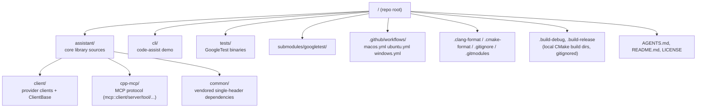

# Codebase Information

<!-- meta:purpose=high-level repo map and stack -->
<!-- meta:audience=ai-assistants,new-contributors -->

## Project at a glance

| Aspect | Value |
|---|---|
| Project name | `Assistant` (CMake `project(Assistant)`) |
| Library target | `assistantlib` (static C++ library) |
| Auxiliary library | `mcp-cpp` (static, MCP protocol implementation) |
| Demo executable | `code-assist` (interactive CLI) |
| Language | C++20 (`CMAKE_CXX_STANDARD 20`, `CMAKE_CXX_EXTENSIONS OFF`) |
| Build system | CMake (`cmake_minimum_required(VERSION 3.10)`) |
| Test framework | GoogleTest (vendored as a git submodule) |
| Top-level namespace | `assistant::` |

## Top-level directory map



## Languages used

- **C++20** — production code (`assistant/`, `cli/`, `tests/`)
- **CMake** — build configuration (`CMakeLists.txt` files)
- **JSON** — configuration files (consumed via `nlohmann::ordered_json`)
- **YAML** — GitHub Actions workflow files

No other languages, runtimes, or build systems are present in the source tree.

## Build targets

| Target | Type | Defined in | Outputs |
|---|---|---|---|
| `mcp-cpp` | static library | `assistant/cpp-mcp/CMakeLists.txt` | linked into `assistantlib` |
| `assistantlib` | static library | `assistant/CMakeLists.txt` | the public C++ API |
| `code-assist` | executable | `cli/CMakeLists.txt` (gated by `ASSISTANTLIB_BUILD_EXAMPLE`) | placed at `${CMAKE_BINARY_DIR}/code-assist` |
| `test_*` (10) | executables | `tests/CMakeLists.txt` (gated by `ASSISTANTLIB_BUILD_TESTS` or `ENABLE_TESTS`) | discovered via `gtest_discover_tests` |

## Public include layout

The library installs no headers (no `install()` rules); consumers add the repo root to their include path and write:

```cpp
#include "assistant/assistant.hpp"      // umbrella header — provides MakeClient(...)
#include "assistant/client/...hpp"       // individual client headers
#include "assistant/config.hpp"          // Config, ConfigBuilder, Endpoint, MCPServerConfig
#include "assistant/function.hpp"        // FunctionTable, FunctionBuilder, FunctionCall
#include "assistant/mcp.hpp"             // MCPClient (stdio / SSE / SSH-remote)
#include "assistant/logger.hpp"          // OLOG, OLOG_INFO, etc.
```

`assistant/assistantlib.hpp` is the legacy umbrella (containing `message`, `messages`, `request`, `response`, `ITransport`, `EndpointKind`, `TransportType`). It is included transitively by `assistant.hpp`.

## CMake options

Set with `-D<OPTION>=ON|OFF` at configure time:

| Option | Default | Effect |
|---|---|---|
| `ASSISTANTLIB_BUILD_EXAMPLE` | `ON` | Build `code-assist` from `cli/` |
| `ASSISTANTLIB_WITH_OPENSSL` | `ON` | Find OpenSSL, define `CPPHTTPLIB_OPENSSL_SUPPORT=1`, link SSL/Crypto (and `Crypt32` on Windows) |
| `ASSISTANTLIB_BUILD_TESTS` | `OFF` | Build `tests/` (also enabled if `ENABLE_TESTS=ON`) |
| `ENABLE_TLS` | unset | Alias that enables OpenSSL behaviour |
| `ENABLE_TESTS` | unset | Alias that enables tests |

Clang and AppleClang receive `-Wthread-safety -D_LIBCPP_ENABLE_THREAD_SAFETY_ANNOTATIONS` repo-wide. The `assistantlib` and `mcp-cpp` targets additionally suppress `-Wno-deprecated-literal-operator` and `-Wno-string-plus-int` for those toolchains.

`compile_commands.json` is generated by CMake and symlinked from the binary dir to the source dir for tooling.

## Continuous integration

Three GitHub Actions workflows live under `.github/workflows/`:

| File | Job | Runner | Matrix |
|---|---|---|---|
| `macos.yml` | `macos` | `macos-latest` | options: `''` and `-DASSISTANTLIB_WITH_OPENSSL=OFF` |
| `ubuntu.yml` | `linux` | `ubuntu-latest` | options: `''` and `-DASSISTANTLIB_WITH_OPENSSL=OFF` |
| `windows.yml` | `msys2` (workflow `name: msys2`) | `windows-latest` + `msys2/setup-msys2@v2` (`clang64`) | options: `''` and `-DASSISTANTLIB_WITH_OPENSSL=OFF` |

All workflows do `actions/checkout@v6` with `submodules: true`, configure with `-DCMAKE_BUILD_TYPE=Release -DENABLE_TESTS=ON`, build, and run `ctest --output-on-failure`. Workflows trigger on push and pull request, ignoring `**.md` and other workflow files. Dependabot is configured (`.github/dependabot.yml`) to update `github-actions` weekly, grouping all updates into one PR.

## Style and formatting

- `.clang-format` (3 lines): `BasedOnStyle: Google`, `IndentWidth: 2`, `ColumnLimit: 80`.
- `.cmake-format` is present (CMake formatter configuration). All `CMakeLists.txt` files follow it.
- No `.editorconfig`, no `.pre-commit-config.yaml`, no other linters.

## Vendored dependencies (single-header, in `assistant/common/`)

| File | Library | Role |
|---|---|---|
| `json.hpp` | nlohmann/json | JSON parsing/serialization (used as `nlohmann::ordered_json`) |
| `httplib.h` | yhirose/cpp-httplib | HTTP/HTTPS client (default transport) |
| `base64.hpp` | macaron Base64 | Image and binary encoding |
| `magic_enum.hpp` | Neargye/magic_enum | Reflection helpers (used to parse `EndpointKind`/`TransportType` from strings) |

External (non-vendored) dependencies:

- **OpenSSL** — required when `ASSISTANTLIB_WITH_OPENSSL=ON` (default).
- **GoogleTest** — pulled in via `submodules/googletest`; only needed if tests are enabled.
- **Threads** (`pthreads`/equivalent) — found in tests via `find_package(Threads)`.
- **`curl` executable** — only used at runtime when `TransportType::curl` is selected (see `assistant/Curl.hpp`); not a build-time dependency.
- **`ssh` executable** — only used when an `MCPClient` is constructed with an `SSHLogin` (remote stdio transport).

## Tests

`tests/CMakeLists.txt` declares 10 GoogleTest binaries via the in-repo `add_gtest()` helper, all linked against `assistantlib`, `gtest_main`, and `Threads::Threads`:

```
test_claude_response_parser    test_openai_client
test_openai_messages_client    test_openai_response_parser
test_openai_response_format    test_config_file
test_config                    test_env_expander
test_process                   test_history
```

Tests are discovered by CTest via `gtest_discover_tests`. The CLI demo lists test binaries that can be run directly, e.g. `.build-release/tests/test_config.exe`.

## What is **not** in this repo

- No package metadata (`vcpkg.json`, `conanfile.txt`, `CPM.cmake`) — dependencies are vendored or system-provided.
- No `install()` targets, no CMake export package — consumers integrate by adding the source directory.
- No Docker, no Kubernetes manifests, no Terraform.
- No web frontend, no scripts beyond CMake.
- No `examples/` directory (despite the README mentioning one).
