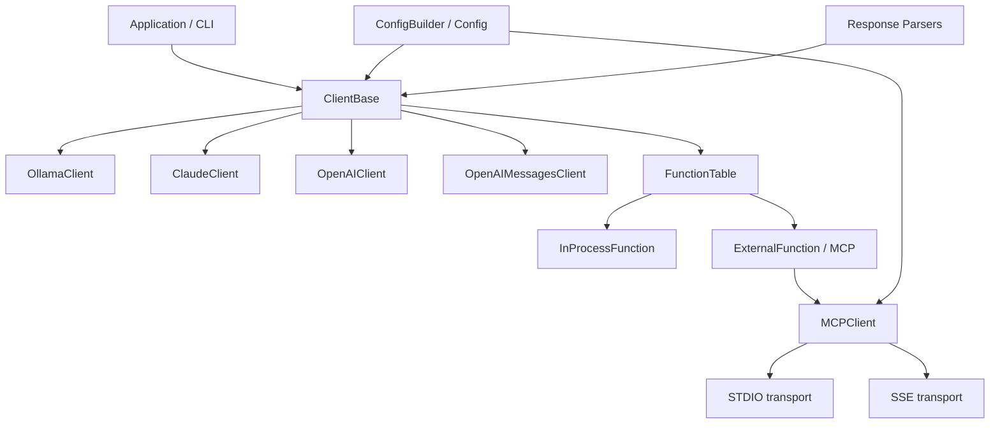

# Codebase Information

## Scope
- Repository: `assistant`
- Primary language: C++20
- Build system: CMake
- Main library target: `assistantlib`
- Example/CLI target: `cli`
- Test target group: `tests`

## High-level structure
- `assistant/`: core library implementation and public headers
- `assistant/client/`: provider-specific clients and shared client base
- `assistant/cpp-mcp/`: MCP protocol integration layer
- `cli/`: interactive demo/entry point
- `tests/`: unit tests built with GoogleTest
- `examples/`: sample configuration and usage artifacts
- `submodules/googletest/`: vendored test dependency

## Technology stack
- C++20 standard library
- CMake build configuration
- OpenSSL when TLS support is enabled
- libcurl-based HTTP implementation via `httplib`/curl wrapper code
- GoogleTest for unit testing
- MCP integration via local and remote transports

## Documented system map

## Supported language observations
- **Supported in this repository:** C++
- **Present as tooling/tests:** JSON, CMake, shell/batch scripts, Python test helpers in vendored googletest
- **Not a primary implementation language:** Python, JavaScript, Rust, Go

## Key integration points
- Configuration loading creates a `Config` that selects the endpoint/client type.
- `MakeClient(...)` constructs the correct client implementation from config content, file path, or parsed config.
- Function registration supports in-process tools and MCP-backed external tools.
- CLI demonstrates chat, tool approval, history, and streaming response handling.

## Notes
- The repository already contains a root `AGENTS.md`; it should be refreshed rather than duplicated in `.agents/summary`.
- The `submodules/googletest` tree is vendored and should usually be treated as third-party source.
