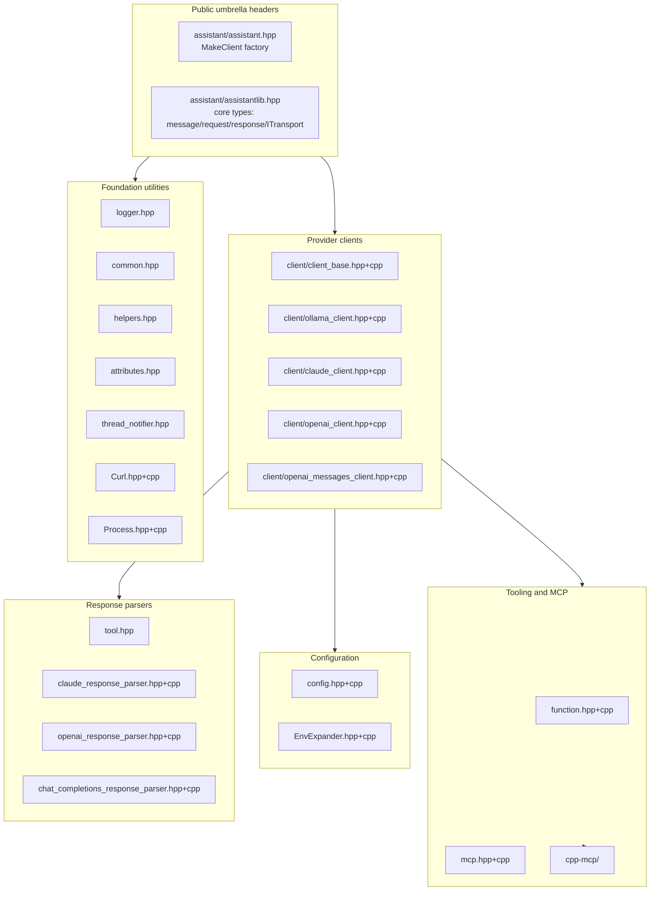

# Components

<!-- meta:purpose=major modules and their responsibilities -->
<!-- meta:audience=ai-assistants,maintainers -->

This page describes each major module, what it owns, and where to find it.

## Module overview

## Foundation

### `assistant/logger.hpp`

Singleton `assistant::Logger` with five `LogLevel` values (`kTrace`, `kDebug`, `kInfo`, `kWarning`, `kError`). Output goes to `std::cerr` by default with ANSI colour, or to a file (`SetLogFile(path)`), or to a custom sink (`SetLogSink(fn)`). Macros: `OLOG(level)`, `OLOG_TRACE/DEBUG/INFO/WARN/ERROR()`. The `LogStream` RAII helper delivers the buffered message to the singleton when destroyed, so `OLOG_INFO() << "x";` is the standard idiom.

### `assistant/common.hpp`

The repo's "shared types" header. Provides:

- `Locker<T>` — RAII-protected value with `with_mut`/`with` callbacks plus `get_value`/`set_value`. Used heavily by `ClientBase` to guard `Endpoint`, system messages, timeouts, model capability cache, pricing, and usage.
- Bitflag helpers: `IsFlagSet<Enum>`, `AddFlagSet<Enum>`.
- `Reason` enum — values delivered to `OnResponseCallback`: `kDone`, `kPartialResult`, `kFatalError`, `kLogNotice`, `kLogDebug`, `kCancelled`, `kRequestCost`, `kToolDenied`, `kToolAllowed`, `kMaxTokensReached`, `kServerCompaction`.
- `ModelCapabilities` bitflags: `kNone | kThinking | kTools | kCompletion | kInsert | kVision`.
- `ChatOptions` bitflags: `kDefault | kNoTools | kNoHistory`.
- `CachePolicy`: `kNone`, `kAuto`, `kStatic` (only static caching has provider-specific behaviour wired up — Anthropic `cache_control: ephemeral`).
- `Pricing`, `Usage`, `TokenUsageStats` structs and helpers (`Usage::Add`, `Usage::CalculateCost`, `Usage::FromClaudeJson`).
- `PRICING_TABLE` — a hard-coded map of model name → per-token USD pricing for current Anthropic and OpenAI tiers, with `FindPricing(name)` and `AddPricing(name, p)` accessors guarded by a mutex.
- Callback signatures: `OnResponseCallback`, `OnToolInvokeCallback`, `CanInvokeToolResult`.

### `assistant/helpers.hpp`

Generic utilities, all `inline`. Notable items:

- `Result<V, E>` and `Err<E>` — minimal Rust-style result type used for filesystem and parser helpers. **Note:** this is not a generic `std::expected` substitute — it lives in helpers and is mostly used inside the CLI demo and config parser.
- `JoinArray(container, sep)` — produces `[a,b,c]`-style strings.
- `trim`, `split_into_lines`, `after_first` — string helpers.
- `try_read_jsons_from_string` — incremental JSON object stream parser used by streaming response handling.
- `CreateDirectoryForFile`, `ReadFileContent`, `CreateNewFile`, `WriteFileContent`, `DeleteFileFromDisk`, `WriteToFile`.
- `ReadYesOrNoFromUser`, `GetTextFromUser`, `GetChoiceFromUser` — interactive console helpers used by the CLI demo.
- Macros: `ASSIGN_OPT_OR_RETURN(decl, expr, return_value)` and `ASSIGN_OPT_OR_RETURN_NULLOPT(decl, expr)` — early-return on `std::optional` absence. `ASSIGN_FUNC_ARG_OR_RETURN(var, expr)` is in `function.hpp` and returns a `FunctionResult` error instead.

### `assistant/attributes.hpp`

Clang thread-safety annotation macros that compile to `__attribute__((...))` on Clang and to nothing elsewhere. Repo-wide `-Wthread-safety` flag (set by the top-level `CMakeLists.txt`) turns them into compile-time checks. Macros: `SCOPED_CAPABILITY`, `REQUIRES`, `ACQUIRE`, `RELEASE`, `GUARDED_BY`, `CALLER_MUST_LOCK`, `FUNCTION_LOCKS`.

### `assistant/thread_notifier.hpp`

Templated `ThreadNotifier<Value>` — a condvar-backed slot. `Wait(milliseconds)` returns `std::optional<Value>` (empty on timeout); `Notify(v)` wakes all waiters. Non-copyable.

### `assistant/Process.hpp` / `Process.cpp`

Cross-platform process runner. Exposes:

- `Process::RunProcessAndWait(argv, output_cb, use_shell=false) → int` — synchronous, with stdout/stderr streamed to `output_cb`; returning `false` from the callback terminates the child.
- `Process::RunProcessAndWait(argv, use_shell=false) → ProcessOutput` — convenience overload that captures full stdout/stderr.
- `Process::RunProcessAsync(argv, output_cb, completion_cb, use_shell=false) → bool` — same model but async.
- `Process::TerminateProcess(pid)`, `Process::IsAlive(pid)`.
- `Process::EnableExecLog(bool)`, `Process::IsExecLogEnabled()` — toggles a debug log of every command launched.

### `assistant/Curl.hpp` / `Curl.cpp`

`assistant::Curl : public ITransport`. An alternative HTTP transport that shells out to the system `curl` binary via `Process`. Useful when the platform's TLS/proxy settings differ from those bundled into httplib. `BuildRequestCommand` materialises request payload and headers to temp files (cleaned up by `BuildCommandResult`'s destructor).

## Core types

### `assistant/assistantlib.hpp` (umbrella for low-level types)

Despite the legacy filename, this is the most fundamental header. It defines:

- `EndpointKind` enum: `ollama`, `anthropic`, `openai`, `moonshotai`.
- `TransportType` enum: `httplib`, `curl`.
- `assistant::json` (alias for `nlohmann::ordered_json`) and `assistant::base64`.
- `assistant::message`, `assistant::messages`, `assistant::request`, `assistant::response` — JSON-derived value types.
- `assistant::image`, `assistant::images` — base64-encoded image attachments.
- `assistant::options`, `assistant::ITransport`, callback typedefs (`on_respons_callback`, `on_raw_respons_callback`).
- File helpers re-exported into `assistant::` (e.g. `DeleteFileFromDisk`).
- Toggles: `assistant::allow_exceptions(bool)`, `assistant::show_requests(bool)`, `assistant::show_replies(bool)`.

### `assistant/tool.hpp`

A small inline `assistant::ResponseParser` for parsing Ollama-shaped streaming responses (`message.content`, `message.tool_calls`, `done`). Other providers have their own parsers (see "Response parsers" below).

## Configuration

### `assistant/config.hpp` / `config.cpp`

Defines `Endpoint`, the pre-built `AnthropicEndpoint` / `OpenAIEndpoint` / `MoonshotAIEndpoint` / `OllamaLocalEndpoint` / `OllamaCloudEndpoint`, `ServerTimeout`, `MCPServerConfig` (with `StdioParams` / `SseParams`), `Config`, and `ConfigBuilder` with `FromFile(path, env_map?)` and `FromContent(json_str, env_map?)`. Enforces "exactly one active endpoint" and applies defaults (`max_tokens=64000`, `context_size=32K`, `compaction_threshold=10000`, `connect_ms=100`, `read/write_ms=10000`, `keep_alive="5m"`).

### `assistant/EnvExpander.hpp` / `EnvExpander.cpp`

`EnvExpander::Expand(json|string, EnvMap?)` traverses any JSON tree and expands `${VAR}` / `$VAR` strings against the provided overlay or the process environment. The `ExpandWithResult(...)` variants return an `ExpandResult` that flags unresolved variables — `ConfigBuilder` uses these to surface readable error messages.

## Function calling

### `assistant/function.hpp` / `function.cpp`

The tool-calling vocabulary:

- `Param` — a named, typed, optionally validated parameter (min/max for numbers, string enum). `ToJSON(EndpointKind)` emits provider-specific schema fragments; OpenAI gets `["string","null"]` for optional types, others get the bare type.
- `FunctionBase` — abstract base. `ToJSON(EndpointKind)` produces the full per-provider tool schema. Subclasses implement `Call(json args) → FunctionResult`. Override-able `CanRun(args) → optional<CanInvokeToolResult>` for per-tool human-in-the-loop.
- `InProcessFunction` — wraps a `FunctionSignature = std::function<FunctionResult(const json&)>` plus an optional per-tool `OnToolInvokeCallback`.
- `ExternalFunction` — bridges a single `mcp::tool` to `FunctionBase`; `Call()` forwards to `MCPClient::Call`.
- `FunctionBuilder` — fluent builder (`SetDescription`, `AddRequiredParam`, `AddOptionalParam`, `AddMinMaxValidation`, `AddStringEnumValidation`, `SetCallback`, `SetHumanInTheLoopCallback`, `Build`).
- `FunctionCall` — `{ name, args, optional invocation_id }`, the model's request to invoke a tool.
- `FunctionResult` — `{ isError, text }`.
- `FunctionTable` — registry (mutex-guarded `std::map<name, shared_ptr<FunctionBase>>`). Methods: `Add`, `AddMCPServer`, `Call`, `CanRunTool`, `Clear`, `ReloadMCPServers(Config*)`, `Merge`, `EnableAll(b)`, `EnableFunction(name, b)`, `GetFunctionsCount`, `IsEmpty`, `ToJSON(kind, cache_policy)`.

## MCP integration

### `assistant/mcp.hpp` / `mcp.cpp`

`assistant::MCPClient` — three constructors:

1. `MCPClient(args, env?)` — local stdio child process; `args` is the command line (`{"npx", "-y", "@modelcontextprotocol/server-filesystem", "/tmp"}`).
2. `MCPClient(base_url, sse_endpoint="/sse", auth_token={}, headers={})` — SSE transport.
3. `MCPClient(SSHLogin, args, env?)` — runs the stdio MCP server on a remote host. The class composes an `ssh ... -p PORT HOST "<escaped command>"` invocation and treats the resulting pipes as the stdio transport.

`Initialise()` performs the MCP `initialize` and `ping` handshake and caches the tool list. `GetFunctions()` returns a `vector<shared_ptr<FunctionBase>>` of `ExternalFunction` wrappers, ready to register on a `FunctionTable`.

### `assistant/cpp-mcp/`

The MCP protocol implementation (built as the static library `mcp-cpp` and linked into `assistantlib`). Files: `mcp_message.[h|cpp]`, `mcp_resource.[h|cpp]`, `mcp_tool.[h|cpp]`, `mcp_client.h`, `mcp_stdio_client.[h|cpp]`, `mcp_sse_client.[h|cpp]`, `mcp_server.[h|cpp]`, `mcp_thread_pool.h`, `mcp_logger.h`. The library contains a full server implementation as well as the client used by `assistant::MCPClient`.

## Provider clients

### `assistant/client/client_base.hpp` / `client_base.cpp`

`ClientBase` — abstract API. Owns `FunctionTable`, `History`, `ChatRequestQueue`, `Locker<Endpoint>`, system messages, server timeout, model-capabilities cache, pricing, aggregated usage, caching policy, transport type, the interrupt flag, and the streaming flag. See `interfaces.md` for the full method list. Defines `ChatRequest`, `ChatRequestFinaliser`, `ChatContext`, `ChatRequestQueue`, and `History` in the same header (they are part of the runtime state of every client).

### `assistant/client/ollama_client.hpp` / `ollama_client.cpp`

The "neutral" implementation. Speaks to a local Ollama server (`http://127.0.0.1:11434`) via `ITransport`. Implements the full lifecycle: `IsRunning`, `List`, `ListJSON`, `GetModelInfo`, `GetModelCapabilities`, `Chat`, `CreateAndPushChatRequest`, `AddToolsResult`, `Interrupt`, plus the protected `ProcessChatRequest`/`ProcessChatRequestQueue`/`CreateClient`/`BuildToolResponseContent`. Also defines `EventType` and `SetInterruptClientLocker` (RAII to register/unregister the active transport for `Interrupt()`).

### `assistant/client/claude_client.hpp` / `claude_client.cpp`

Anthropic client. Overrides `GetModelInfo`, `GetModelCapabilities`, `CreateAndPushChatRequest`, `AddToolsResult`, `ProcessChatRequest`, `ProcessChatRequestQueue`, and `GetMessages` (Claude does not use a `role:"system"` message; the system prompt goes in a separate field). Uses `claude::ResponseParser` for streaming.

### `assistant/client/openai_client.hpp` / `openai_client.cpp`

OpenAI client targeting `/v1/responses`. Overrides `GetModelCapabilities`, `AddToolsResult`, and the streaming pipeline (`OnRawResponse`, `ProcessChatRequest`, `HandleResponse`). Forces `IsStreaming() == true`. Uses `OpenAIResponseParser`.

### `assistant/client/openai_messages_client.hpp` / `openai_messages_client.cpp`

OpenAI-compatible client targeting the standard `/v1/chat/completions` endpoint (used for Moonshot AI and other compatible APIs — note the default endpoint constructor is `MoonshotAIEndpoint`). Overrides `GetModelCapabilities`, `AddToolsResult`, `InvokeTools`, and the streaming pipeline. Uses `chat_completions::ResponseParser`.

## Response parsers

| File | Type | Used by |
|---|---|---|
| `assistant/tool.hpp` | inline `assistant::ResponseParser` | Ollama-style responses |
| `assistant/claude_response_parser.[hpp\|cpp]` | `claude::ResponseParser` | `ClaudeClient` (streaming SSE message events) |
| `assistant/openai_response_parser.[hpp\|cpp]` | `OpenAIResponseParser` | `OpenAIClient` (`/v1/responses` events) |
| `assistant/chat_completions_response_parser.[hpp\|cpp]` | `chat_completions::ResponseParser` | `OpenAIMessagesClient` (`/v1/chat/completions` deltas) |

Each parser handles streaming-frame reassembly, extracts text/thinking deltas, decodes tool-call requests, and surfaces token-usage events.

## CLI demo (`cli/`)

### `cli/main.cpp`

Entry point of the `code-assist` executable. Parses CLI args (see `workflows.md`), constructs a `Config`, calls `MakeClient(...)`, and runs an interactive REPL with slash commands and a streaming response printer. Contains three demo built-in tools (file write/read/create) gated by `--no-builtin-mcp` and a global `OnToolInvokeCallback` (`CanRunTool`) that prompts the operator with `[y/n]`. The CLI demo also registers a per-tool override on `Read_file_content_from_a_given_path` via `FunctionBuilder::SetHumanInTheLoopCallback(CanRunTool)` to demonstrate the override path.

### `cli/utils.hpp`

Hosts the interactive helpers used by `main.cpp` — note that several similar helpers also live in `assistant/helpers.hpp` (currently both files coexist; see `review_notes.md`).

## Tests (`tests/`)

10 GoogleTest binaries, each focused on one subsystem:

| Binary | Covers |
|---|---|
| `test_config_file` | `ConfigBuilder::FromFile` |
| `test_config` | `ConfigBuilder::FromContent` and built-in defaults |
| `test_env_expander` | `EnvExpander` (string and recursive JSON) |
| `test_history` | `History` swap/clear/shrink behaviour |
| `test_process` | `Process::RunProcessAndWait` / `RunProcessAsync` |
| `test_claude_response_parser` | streaming Anthropic events |
| `test_openai_response_parser` | streaming `/v1/responses` events |
| `test_openai_response_format` | OpenAI tool/JSON schema generation |
| `test_openai_client` | client-level behaviour against fixtures |
| `test_openai_messages_client` | `/v1/chat/completions` client |
