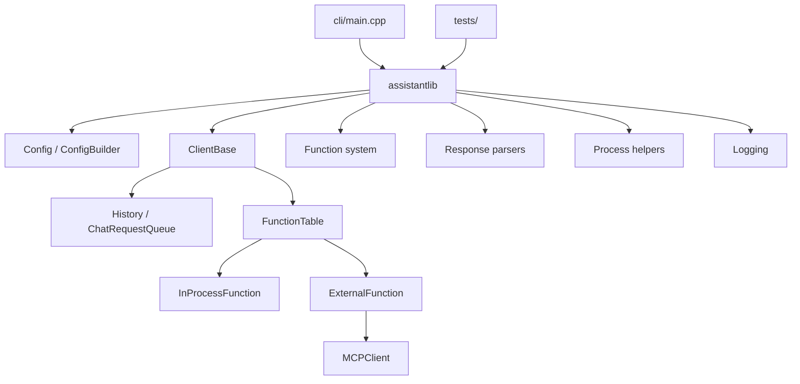

# Components

## Main components

### `assistant/` core library
- Public headers and implementation for the assistant runtime.
- Contains client implementations, config handling, function abstraction, logging, process helpers, and response parsers.

### `assistant/client/`
- `client_base.*`: shared client interface and request/history machinery.
- `ollama_client.*`: local Ollama integration.
- `claude_client.*`: Anthropic integration.
- `openai_client.*`: OpenAI responses API integration.
- `openai_messages_client.*`: OpenAI-compatible messages API integration.

### `assistant/cpp-mcp/`
- Lower-level MCP protocol implementation.
- Includes client/server/tool/resource/message helpers and transport helpers.

### `cli/`
- Demo/interactive application.
- Demonstrates configuration loading, tool registration, approval callback usage, and streaming output.

### `tests/`
- GoogleTest-based tests for configuration, environment expansion, parsers, history, process handling, and client behavior.

## Component responsibility map

## File-level highlights
- `assistant.hpp`: client factory entry points.
- `config.hpp` / `config.cpp`: configuration model and parsing.
- `function.hpp` / `function_base.hpp` / `function.cpp`: tool definition and invocation.
- `mcp.hpp` / `mcp.cpp`: MCP integration surface.
- `Curl.*`: HTTP/transport wrapper.
- `EnvExpander.*`: variable expansion in config.
- `Process.*`: process execution and helper operations.
- `chat_completions_response_parser.*`, `openai_response_parser.*`, `claude_response_parser.*`: provider-specific response normalization.

## External dependency sub-tree
- `submodules/googletest/` is not a product component; it is a test dependency tree.

## Maintenance notes
- The most volatile code paths are provider clients and parsers because API payloads change with upstream providers.
- MCP integration spans multiple files, so edits often require coordinated changes across the function and client layers.
