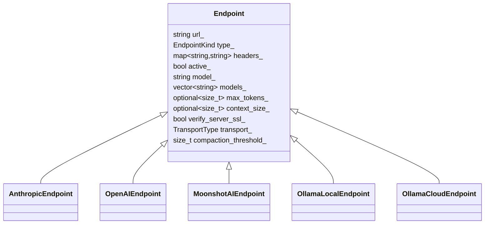
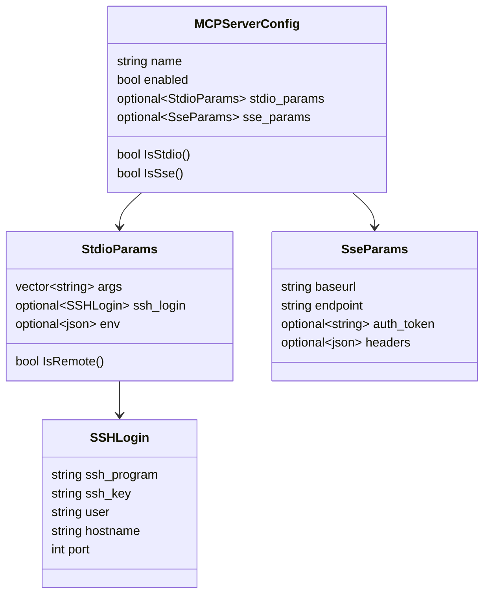
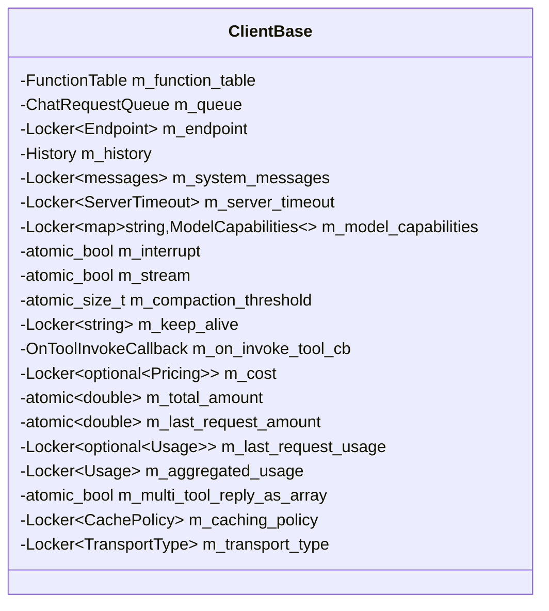
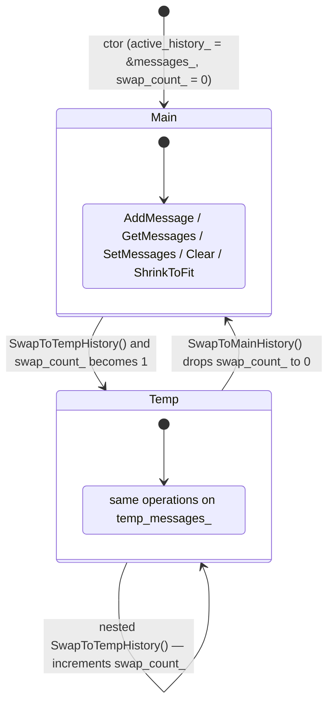

# Data models

<!-- meta:purpose=configuration, runtime state, message types -->
<!-- meta:audience=ai-assistants,library-consumers -->

This page covers the JSON configuration shape, the in-memory runtime data, and the message/response value types.

## Configuration JSON

Parsed by `assistant::ConfigBuilder::FromFile(path, env_map?)` or `FromContent(json_str, env_map?)`. The expected shape (informally):

```json
{
  "log_level": "info",
  "stream": true,
  "keep_alive": "5m",
  "compaction_threshold": 10000,
  "server_timeout": {
    "connect_ms": 100,
    "read_ms": 10000,
    "write_ms": 10000
  },
  "endpoints": [
    {
      "type": "anthropic",
      "url": "https://api.anthropic.com",
      "model": "claude-sonnet-4-5",
      "active": true,
      "headers": { "x-api-key": "${ANTHROPIC_API_KEY}" },
      "max_tokens": 8192,
      "context_size": 200000,
      "verify_server_ssl": true,
      "transport": "httplib"
    }
  ],
  "mcp_servers": [
    {
      "name": "filesystem",
      "enabled": true,
      "stdio": {
        "args": ["npx", "-y", "@modelcontextprotocol/server-filesystem", "/tmp"],
        "env": { "FOO": "bar" },
        "ssh": {
          "ssh_program": "ssh",
          "user": "${SSH_USER}",
          "hostname": "remote.example.com",
          "port": 22,
          "ssh_key": "/home/me/.ssh/id_ed25519"
        }
      }
    },
    {
      "name": "internal-api",
      "enabled": true,
      "sse": {
        "baseurl": "https://mcp.internal/api",
        "endpoint": "/sse",
        "auth_token": "${MCP_TOKEN}",
        "headers": { "X-Tenant": "team-a" }
      }
    }
  ]
}
```

Constraints enforced by `ConfigBuilder`:

- Exactly one endpoint should be marked `"active": true`. If none are marked active, the first one becomes the effective endpoint.
- `endpoints[].type` must be one of `ollama`, `anthropic`, `openai`, `moonshotai` (decoded via `magic_enum::enum_cast<EndpointKind>`).
- `endpoints[].transport` (if present) must be `httplib` or `curl` (decoded via `magic_enum::enum_cast<TransportType>`).
- Each `mcp_servers[]` entry must contain exactly one of `stdio` or `sse`.
- All string values are `EnvExpander`-processed before validation; `${VAR}` and `$VAR` references are resolved against the optional `env_map` parameter and then the process environment.

Defaults (when fields are omitted):

| Field | Default |
|---|---|
| `log_level` | `info` |
| `stream` | `true` |
| `keep_alive` | `"5m"` |
| `compaction_threshold` | `10000` |
| `server_timeout.connect_ms` | `100` |
| `server_timeout.read_ms` | `10000` |
| `server_timeout.write_ms` | `10000` |
| `endpoint.max_tokens` | `64000` |
| `endpoint.context_size` | `32 * 1024` |
| `endpoint.verify_server_ssl` | `true` |
| `endpoint.transport` | `httplib` |

## Endpoint hierarchy

`Endpoint` (`assistant/config.hpp`) is the value object for a single provider configuration. The header pre-builds five convenience subclasses with sensible defaults:



URL constants (`assistant/config.hpp`):

| Constant | Value |
|---|---|
| `kEndpointOllamaLocal` | `http://127.0.0.1:11434` |
| `kEndpointAnthropic` | `https://api.anthropic.com` |
| `kEndpointOllamaCloud` | `https://ollama.com` |
| `kEndpointOpenAI` | `https://api.openai.com` |

## MCP server configuration



## Message / request / response

These are defined in `assistant/assistantlib.hpp` as JSON-derived value types using `nlohmann::ordered_json`:

| Type | Shape |
|---|---|
| `assistant::message` | `{ "role": <string>, "content": <string>, optional "images": [...], optional "tool_calls": [...] }` |
| `assistant::messages` | `std::vector<message>` |
| `assistant::request` | JSON object with model, messages, options, tools |
| `assistant::response` | JSON object returned by the provider; `as_json()` exposes the underlying `json` |
| `assistant::image` | Holds a base64-encoded image; constructed via `image::from_file(path)` or `image::from_base64_string(s)` |
| `assistant::images` | `std::vector<std::string>` of base64 strings |

Assistant-side text uses `kAssistantRole = "assistant"` (declared in `client_base.hpp`).

## Function calling types

```cpp
struct FunctionCall {
  std::string name;
  json args;
  std::optional<std::string> invocation_id;  // server-side
};

struct FunctionResult {
  bool isError{false};
  std::string text;
};

struct CanInvokeToolResult {
  bool can_invoke{true};
  std::string reason;  // shown to the model when denied
  bool IsAllowed() const;
};

class Param {
  std::string m_name;
  std::string m_desc;
  std::string m_type;            // "string"/"number"/"integer"/"boolean"/"array"/"object"
  std::optional<int> m_minValue, m_maxValue;
  std::optional<std::vector<std::string>> m_stringEnum;
  bool m_required;
};
```

## Runtime state on `ClientBase`



## `History` semantics

`History` owns two message vectors — `messages_` (main) and `temp_messages_` — plus a pointer `active_history_` and a counter `swap_count_` (all `GUARDED_BY(mutex_)`).



`ShrinkToFit(max_size)` removes oldest messages until the active history's length is `≤ max_size`. `ClearAll()` empties both vectors regardless of which is active.

## Pricing and usage

```cpp
struct Pricing {
  double input_tokens;                 // $ per 1 input token
  double cache_creation_input_tokens;  // $ per 1 cache-creation input token
  double cache_read_input_tokens;      // $ per 1 cache-read input token
  double output_tokens;                // $ per 1 output token
};

struct Usage {
  int input_tokens;
  int cache_creation_input_tokens;
  int cache_read_input_tokens;
  int output_tokens;
  Usage& Add(const Usage&);
  double CalculateCost(const Pricing&) const;
  static Usage FromClaudeJson(json);
};

struct TokenUsageStats {
  int total_tokens_used;
  int input_tokens, output_tokens;
  int cache_creation_input_tokens, cache_read_input_tokens;
  size_t context_size;
  size_t max_tokens;
  double GetContextUsagePercentage() const;
  int GetRemainingTokens() const;
  bool IsNearContextLimit(double threshold = 80.0) const;
  bool IsContextExceeded() const;
};
```

The hard-coded `assistant::PRICING_TABLE` (in `common.hpp`) maps model names to per-token USD `Pricing` rates. It currently includes Claude Sonnet/Opus/Haiku 4.x families and GPT-5 family entries.

## Bitflag enums

```cpp
enum class ModelCapabilities {
  kNone     = 0,
  kThinking = 1 << 0,
  kTools    = 1 << 1,
  kCompletion = 1 << 2,
  kInsert   = 1 << 3,
  kVision   = 1 << 4,
};

enum class ChatOptions {
  kDefault   = 0,
  kNoTools   = 1 << 0,
  kNoHistory = 1 << 1,
};
```

Manipulate with `assistant::IsFlagSet(flags, flag)` and `assistant::AddFlagSet(flags, flag)`.

## CachePolicy

```cpp
enum class CachePolicy {
  kNone,    // no caching
  kAuto,    // let the provider decide (currently a no-op marker)
  kStatic,  // explicitly tag static prompt segments
};
```

When `CachePolicy::kStatic` is set on an Anthropic client, `FunctionTable::ToJSON(...)` adds `cache_control: {type: "ephemeral"}` to the last tool entry; clients also tag the appropriate system message blocks.

## Transport selection

```cpp
enum class TransportType { httplib, curl };
```

`httplib` is the default. Switching to `curl` causes `OllamaClient::CreateClient()` (and overrides in subclasses) to instantiate `assistant::Curl`, which performs requests by spawning the system `curl` binary.
