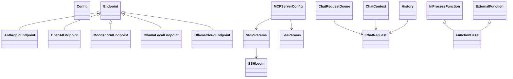

# Data Models

## Core configuration models

### `Config`
Represents the parsed runtime configuration.
Key concerns:
- endpoint selection
- log level
- keep-alive behavior
- streaming toggle
- timeout settings
- MCP server definitions

### `Endpoint`
Base runtime endpoint model.
Fields include:
- URL
- endpoint type
- headers
- active flag
- model name
- available models list
- max tokens
- context size
- SSL verification flag
- transport type

### Specialized endpoint types
- `AnthropicEndpoint`
- `OpenAIEndpoint`
- `MoonshotAIEndpoint`
- `OllamaLocalEndpoint`
- `OllamaCloudEndpoint`

### MCP server config
- `MCPServerConfig`
- `StdioParams`
- `SseParams`
- `SSHLogin`

## Runtime state models
- `ChatRequest`: stores callback, request data, selected model, finalizer, and pending function calls.
- `ChatContext`: carries the active client, model, thinking state, request reference, and accumulated response text.
- `ChatRequestQueue`: synchronized queue of pending requests.
- `History`: manages active and temporary message stores with nested swap semantics.

## Function/tool models
- `FunctionBase`: shared representation for tools.
- `InProcessFunction`: callable local tool with optional approval hook.
- `ExternalFunction`: wrapper around MCP tools.
- `Param`: tool parameter metadata.
- `FunctionResult`: success/error + text payload.
- `FunctionCall`: tool invocation description used during chat and execution.

## Mermaid model map

## Data handling notes
- Configuration values may be expanded from environment variables before use.
- History is intentionally mutable and thread-safe.
- Some fields have code-defined defaults that documentation should treat as implementation defaults rather than user-configured facts.
