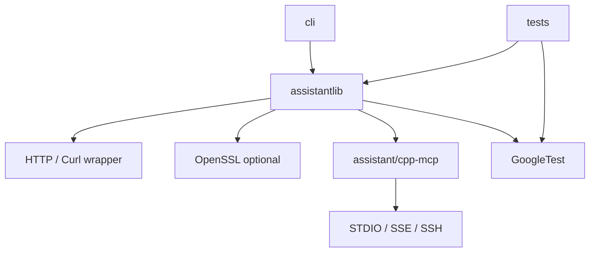

# Dependencies

## External dependencies used by the repository
- **CMake**: build orchestration.
- **OpenSSL**: optional TLS support.
- **libcurl / HTTP transport layer**: HTTP request execution.
- **GoogleTest**: unit testing framework.
- **MCP C++ support**: vendored under `assistant/cpp-mcp/` and treated as an internal third-party component.

## Platform dependencies
- Windows-specific socket/linker support is enabled in CMake when building on Windows.
- Unix-like builds enable position-independent code for the static library.
- Clang/AppleClang receive additional warning-suppression flags in some build paths.

## Dependency map

## Dependency usage notes
- TLS support is conditional; code paths may compile differently depending on `ASSISTANTLIB_WITH_OPENSSL` or `ENABLE_TLS`.
- `submodules/googletest` is vendored and should not be confused with an external package manager dependency.
- Build and runtime behavior may differ across Windows, Unix, and Apple platforms.

## What not to assume
- Do not assume all HTTP details are abstracted identically across providers.
- Do not assume every provider uses the same request/response schema; separate parsers exist for that reason.
