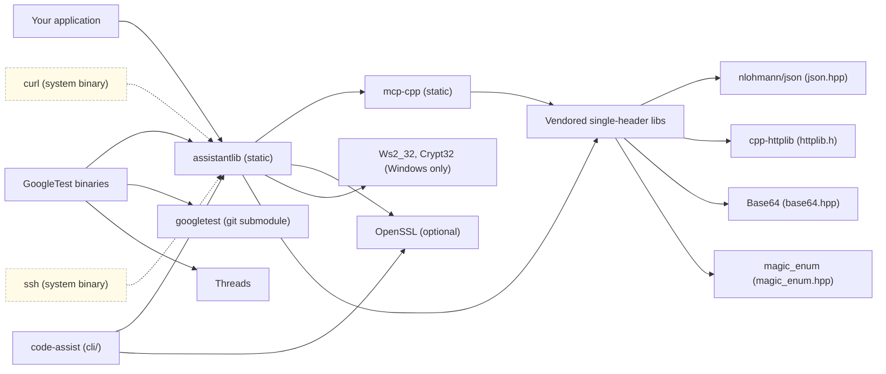

# Dependencies

<!-- meta:purpose=external dependencies and their usage -->
<!-- meta:audience=ai-assistants,maintainers -->

## Dependency map

## Vendored single-header dependencies

All four live in `assistant/common/` and are pulled in via `#include "assistant/common/<file>"`. They are not git submodules — the files are committed directly.

| Header | Library | Upstream | License | Used for |
|---|---|---|---|---|
| `json.hpp` | nlohmann/json | github.com/nlohmann/json | MIT | All JSON in/out (`assistant::json = nlohmann::ordered_json`) |
| `httplib.h` | yhirose/cpp-httplib | github.com/yhirose/cpp-httplib | MIT | Default HTTP transport; `CPPHTTPLIB_OPENSSL_SUPPORT=1` is defined when OpenSSL is enabled |
| `base64.hpp` | macaron/Base64 | gist.github.com/tomykaira | MIT | `assistant::image` encoding; tool-call argument encoding |
| `magic_enum.hpp` | Neargye/magic_enum | github.com/Neargye/magic_enum | MIT | Parse `EndpointKind` and `TransportType` from configuration strings |

Updating any of these means dropping a newer single-file release into `assistant/common/`.

## Git submodules

| Submodule | Path | Purpose |
|---|---|---|
| `submodules/googletest` | tracked via `.gitmodules` (`https://github.com/google/googletest.git`) | Test framework used by all `tests/test_*.cpp` |

`actions/checkout@v6` is invoked with `submodules: 'true'` in every CI workflow. Local clones must use `git clone --recurse-submodules` (or `git submodule update --init --recursive` after the fact) to build the tests.

## CMake-discovered dependencies

| Package | Triggered by | Behaviour |
|---|---|---|
| `OpenSSL` (`SSL`, `Crypto`) | `ASSISTANTLIB_WITH_OPENSSL=ON` (default) or `ENABLE_TLS=ON` | `find_package(OpenSSL ... REQUIRED)`. Adds `-DCPPHTTPLIB_OPENSSL_SUPPORT=1`, links `OpenSSL::SSL`, `OpenSSL::Crypto`, and `Crypt32` on Windows. |
| `Threads` | tests-only (`tests/CMakeLists.txt`) | `find_package(Threads REQUIRED)`; tests link `Threads::Threads`. |
| `Ws2_32` | Windows | Linked into `assistantlib` whenever `WIN32` is true (used by `httplib`). |

`assistantlib` is also marked `POSITION_INDEPENDENT_CODE` on UNIX/Apple to keep it linkable into shared objects.

## Runtime tools (not build-time)

These are needed only at run time when specific features are exercised; they are not validated by CMake:

| Tool | When required | Configured by |
|---|---|---|
| `curl` (system binary) | When the active client uses `TransportType::curl` | `client->SetTransportType(TransportType::curl)` or `endpoints[].transport: "curl"` in the config |
| `ssh` (system binary) | When an MCP server is configured with an `ssh` block (or an `MCPClient` is constructed with `SSHLogin`) | `mcp_servers[*].stdio.ssh` in the config |
| MCP server commands | Whatever the user puts in `mcp_servers[*].stdio.args` (e.g. `npx`, `uv`, custom binaries) | `mcp_servers[*].stdio.args` |

Missing runtime binaries surface as `MCPClient::Initialise()` returning `false` (with a warning logged), or as transport-level errors propagated to the `OnResponseCallback` with `Reason::kFatalError`.

## Provider runtime dependencies

The library itself only speaks HTTP(S). What you also need outside the build:

| Provider | Account / endpoint | Auth header (typical) |
|---|---|---|
| Anthropic Claude | `https://api.anthropic.com` API key | `x-api-key: ${ANTHROPIC_API_KEY}`, plus `anthropic-version: 2023-06-01` |
| OpenAI | `https://api.openai.com` API key | `Authorization: Bearer ${OPENAI_API_KEY}` |
| Moonshot AI / OpenAI-compatible | provider-specific base URL | provider-specific |
| Ollama (local) | `http://127.0.0.1:11434` (must be running) | none |
| Ollama (cloud) | `https://ollama.com` | provider-specific |

Headers are passed through `endpoints[].headers` in the configuration; the recommended pattern is `${VAR}` interpolation so secrets stay in the environment.

## Compiler and toolchain matrix

CI proves the library builds with:

| Platform | Compiler family | C++ standard |
|---|---|---|
| macOS (latest) | AppleClang | C++20 |
| Ubuntu (latest) | GCC (default) | C++20 |
| Windows (MSYS2 `clang64`) | Clang via MinGW | C++20 |

Clang/AppleClang receive `-Wthread-safety -D_LIBCPP_ENABLE_THREAD_SAFETY_ANNOTATIONS` plus the per-target warning suppressions noted in `codebase_info.md`. There is no MSVC build path; consumers wanting MSVC must add it themselves.

## What is **not** depended on

- No `boost`, no `abseil`, no `fmt`, no `spdlog`, no `protobuf`.
- No package manager (no `vcpkg.json`, no `conanfile.txt`, no `CPM.cmake`).
- No Python, no Node, no Ruby — every script is a shell or CMake one-liner.
- No installer (no `install()` target, no `<package>Config.cmake` export). Consumers integrate with `add_subdirectory(assistant)` (or by replicating the file list) and link against `assistantlib`.
