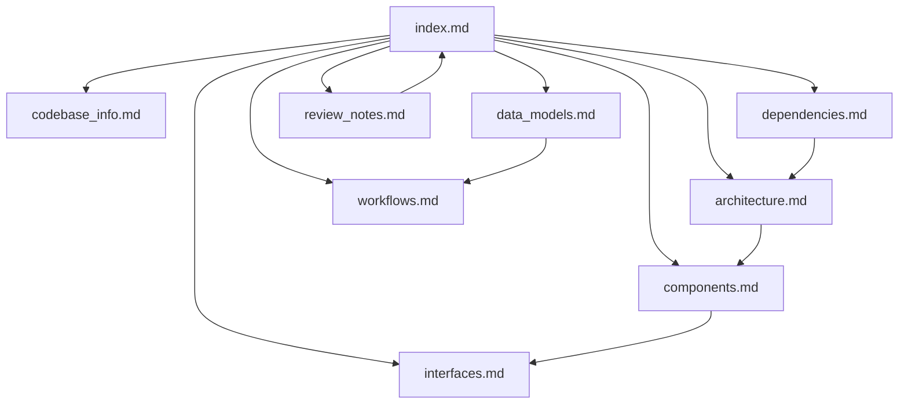

# Knowledge Base Index

This is the primary entry point for AI assistants working in this repository.
Use it first, then consult the linked documents below based on the question.

## How to use this documentation
1. Start here to identify the right document.
2. Read the most relevant focused file instead of loading everything.
3. Use `architecture.md` for design questions, `components.md` for implementation questions, `interfaces.md` for API questions, `workflows.md` for behavior questions, `data_models.md` for state/data questions, and `dependencies.md` for third-party and build dependency questions.
4. Use `review_notes.md` to understand documentation gaps and caveats.
5. Use `codebase_info.md` for a quick structural overview and Mermaid map.

## Document map
| File | Purpose | Best used for |
|---|---|---|
| `codebase_info.md` | Repository snapshot, top-level structure, and a Mermaid system map | Fast orientation, repo layout, and technology stack |
| `architecture.md` | System architecture, boundaries, and design patterns | “How is the system organized?” |
| `components.md` | Major modules and responsibilities | “Where does this feature live?” |
| `interfaces.md` | Public APIs, callbacks, and integration points | “How do I call or extend this?” |
| `data_models.md` | Core structures, config objects, and state containers | “What data does the system use?” |
| `workflows.md` | Important runtime flows and operational sequences | “What happens when X runs?” |
| `dependencies.md` | External libraries and platform dependencies | “What does this rely on?” |
| `review_notes.md` | Consistency/completeness findings and limitations | “What documentation is missing or uncertain?” |

## Guidance for question routing
- Ask about repo layout, entry points, or file navigation: read `codebase_info.md` and `components.md`.
- Ask about client creation, tool calling, or MCP integration: read `interfaces.md` and `workflows.md`.
- Ask about configuration or runtime state: read `data_models.md` and `components.md`.
- Ask about build/runtime dependencies: read `dependencies.md`.
- Ask about known gaps or uncertain areas: read `review_notes.md`.

## Relationship between documents

## Repository-specific navigation hints
- The main library is under `assistant/`.
- Provider implementations live under `assistant/client/`.
- MCP support is split between `assistant/mcp.hpp`, `assistant/mcp.cpp`, and `assistant/cpp-mcp/`.
- The CLI demo is under `cli/main.cpp`.
- Tests are under `tests/` and are wired through `tests/CMakeLists.txt`.
- Root `AGENTS.md` is the human/agent operating guide for day-to-day use.

## When to load more detail
- If you need implementation-specific behavior, move from this index to the target focused document.
- If documentation and source appear to conflict, consult `review_notes.md` first, then verify in source.
