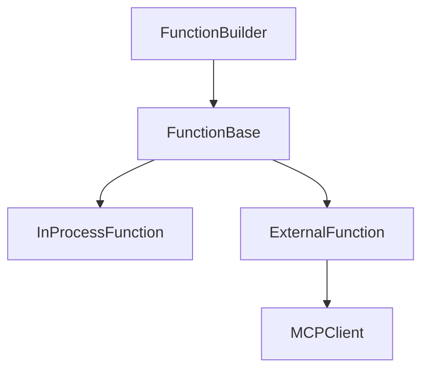
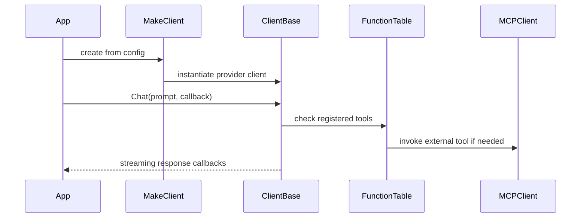

# Interfaces

## Primary public entry points

### Client factory
- `assistant::MakeClient(std::optional<Config>)`
- `assistant::MakeClient(const std::string& config_content)`
- `assistant::MakeClient(const std::filesystem::path& path)`

These create the appropriate concrete client from configuration or config source.

### Client interface
`ClientBase` is the main abstraction for runtime behavior.

Key responsibilities:
- `Chat(...)`
- `IsRunning()`
- `List()` / `ListJSON()`
- `GetModelInfo(...)`
- `GetModelCapabilities(...)`
- `AddSystemMessage(...)`
- `SetHistorySize(...)`
- `GetHistory()` / `SetHistory(...)`
- `GetFunctionTable()` / `ClearFunctionTable()`
- `SetToolInvokeCallback(...)`
- `ApplyConfig(...)`
- cost and usage tracking methods

## Callback interfaces
- **Response callback**: receives streaming text, completion status, and reasoning/thinking state.
- **Human-in-the-loop callback**: determines whether a tool may execute.
- **Function callback**: executes in-process tool logic.

## Function/tool interfaces

### FunctionBuilder
- `SetDescription(...)`
- `AddParam(...)`
- `AddRequiredParam(...)`
- `AddOptionalParam(...)`
- `SetCallback(...)`
- `SetHumanInTheLoopCallabck(...)`
- `Build()`

### FunctionTable
- `Add(...)`
- `AddMCPServer(...)`
- `Call(...)`
- `EnableAll(...)`
- `EnableFunction(...)`
- `GetFunctionsCount()`
- `IsEmpty()`
- `ToJSON(...)`
- `Clear()`

## MCP interface surface
- `MCPClient` supports STDIO and SSE initialization.
- Remote STDIO may use `SSHLogin`.
- MCP tools are exposed as `mcp::tool` objects and wrapped as assistant functions.

## Configuration interfaces
- `Config` exposes endpoint selection, log level, keep-alive, streaming, timeout, and MCP server lists.
- `Endpoint` carries URL, type, headers, model, token limits, context size, SSL verification, and transport kind.
- `ServerTimeout` converts millisecond values into seconds/microseconds pairs for transport APIs.

## Integration points that matter to agents
- Tool approval can block execution before invocation.
- Provider selection depends on endpoint type rather than separate factory types.
- MCP tool exposure depends on successful client initialization.
- Parsing code is provider-specific and should be consulted when response shape changes.

## Mermaid sequence view

