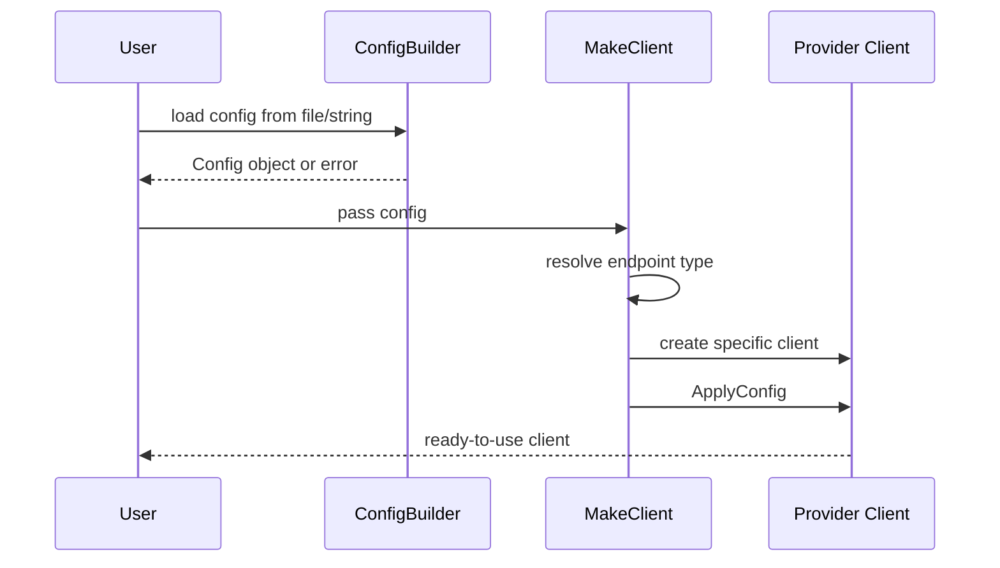
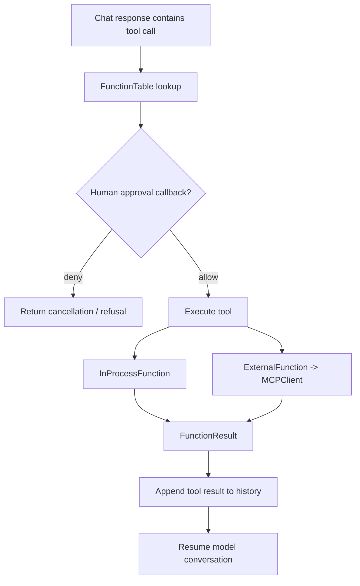

# Workflows

## Client creation workflow

## Chat and response workflow
1. Application calls `Chat(...)` on the client.
2. The client prepares a `ChatRequest` and context.
3. History and system messages are incorporated unless disabled.
4. Provider-specific request payload is generated.
5. Streaming or completion callbacks deliver response chunks.
6. Tool calls are detected and routed through the function table.
7. Final response and usage/cost data are recorded.

## Tool invocation workflow

## MCP initialization workflow
- `MCPClient` may initialize STDIO or SSE transport.
- STDIO can be local or remote via `SSHLogin`.
- Initialization populates the tool list from the MCP server.
- Tools are wrapped as assistant function objects for later invocation.

## History management workflow
- History is stored in a bounded structure.
- New messages are appended after user, assistant, and tool events.
- If the window size is exceeded, older entries are removed.
- Temporary history can be swapped in and out for special operations.

## CLI workflow
- Parse command-line flags.
- Load config file.
- Create client.
- Register example functions.
- Set approval callback.
- Wait for provider readiness.
- Start interactive chat loop.

## Workflow caveats
- Provider streaming behaviors differ, so response parsing is not fully uniform.
- Tool execution can be interrupted by human approval or by client interruption.
- Some workflow details are driven by provider API constraints and not fully visible from top-level headers alone.
