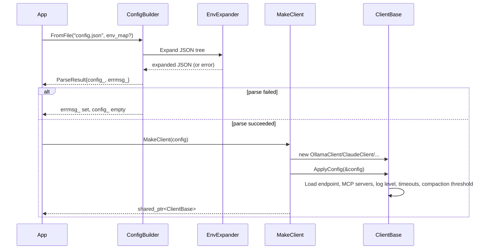
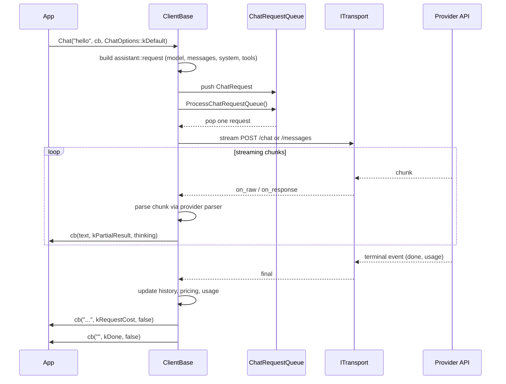
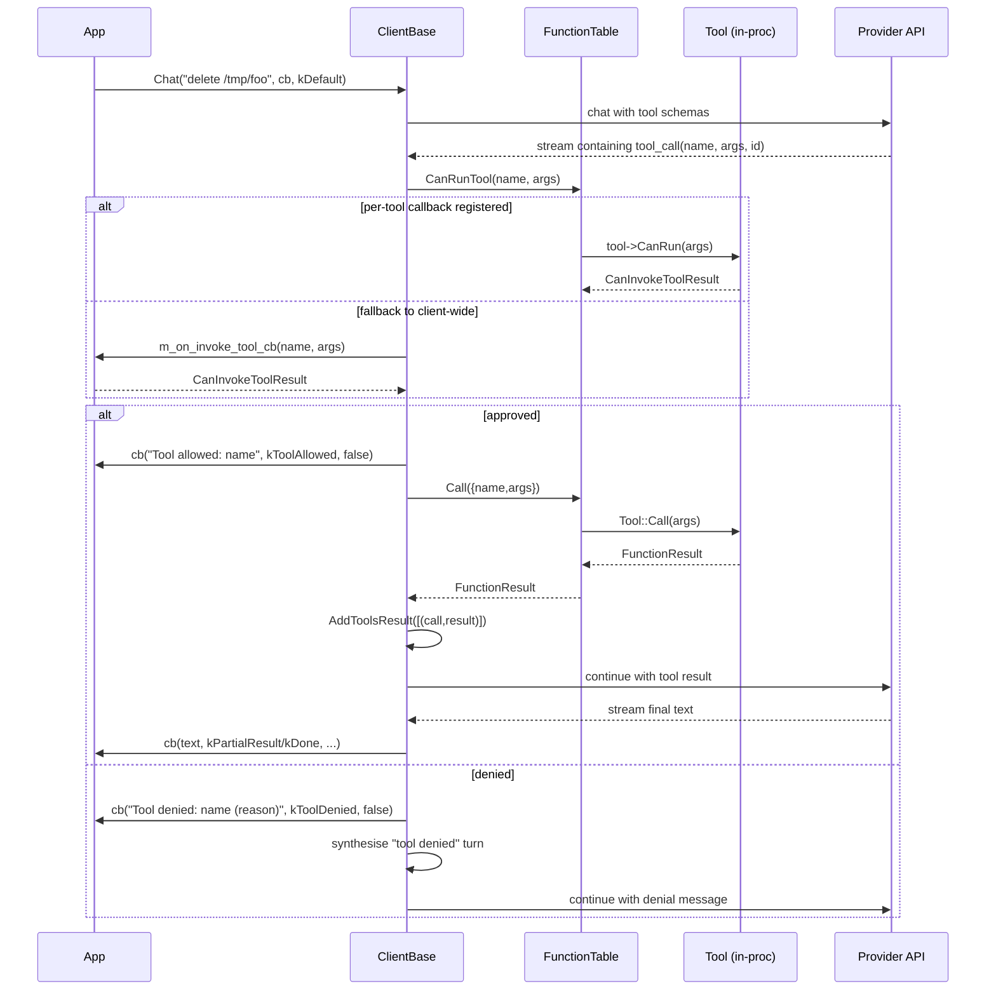
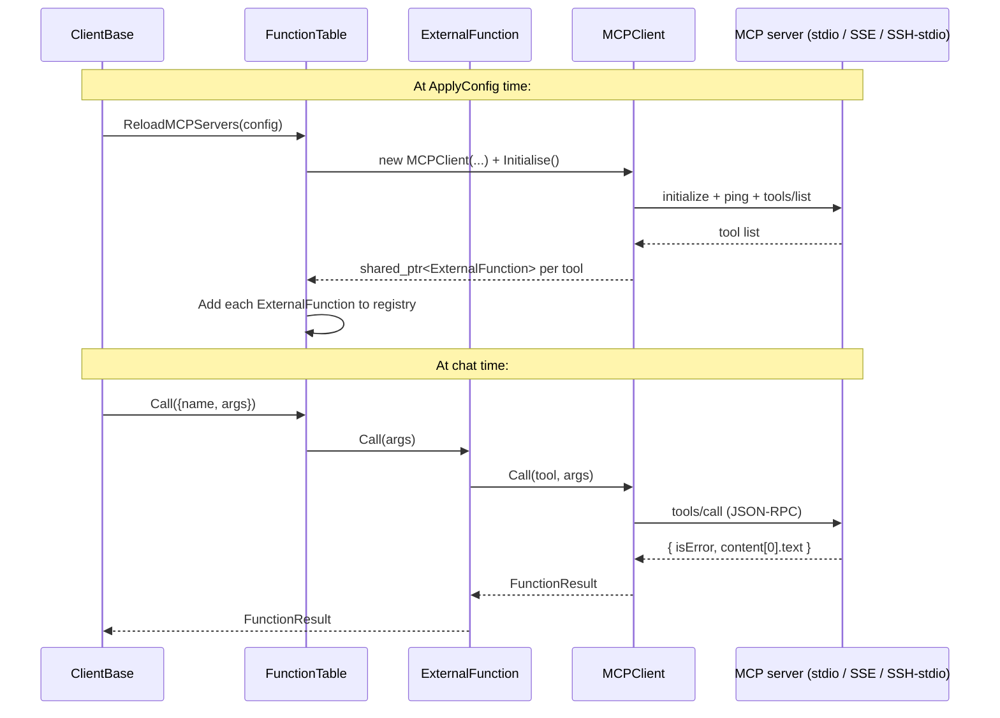
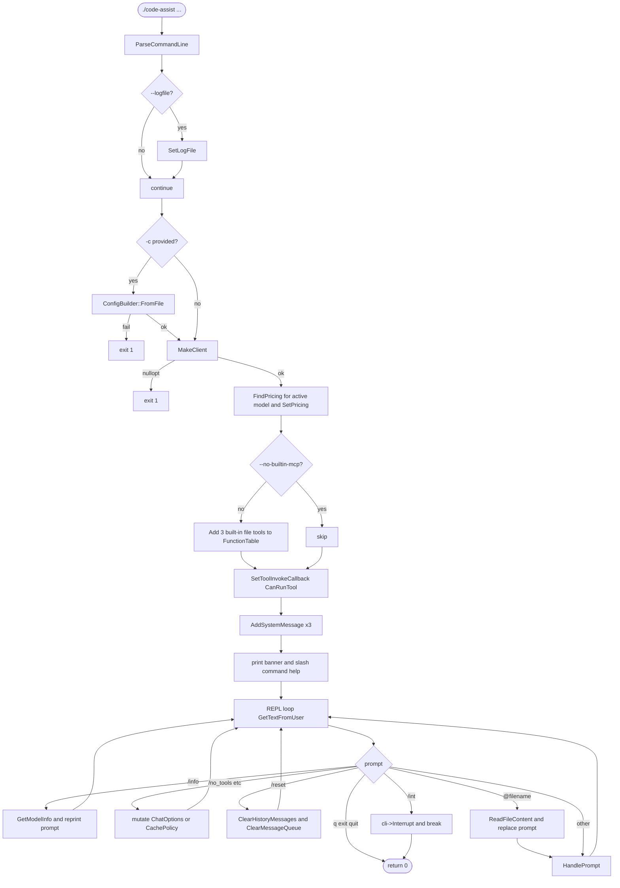
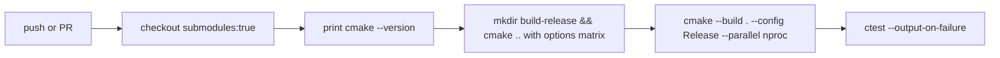

# Workflows

<!-- meta:purpose=runtime sequences and operational flows -->
<!-- meta:audience=ai-assistants,operators -->

## 1. Application startup (using `MakeClient`)



Failure modes a caller should handle:

- `ConfigBuilder` returns `ParseResult` with `config_ = nullopt` and a human-readable `errmsg_` when JSON is malformed, structurally invalid, or contains an unknown `EndpointKind`/`TransportType`.
- `MakeClient` returns `nullopt` when the config is missing, has no endpoint, or a constructor throws.

## 2. Single chat turn (no tools)



## 3. Tool-calling turn (with human-in-the-loop)



The CLI demo wires the prompt-style approval gate at the **client level** with `cli->SetToolInvokeCallback(CanRunTool)` and **also** registers a per-tool `SetHumanInTheLoopCallback(CanRunTool)` on `Read_file_content_from_a_given_path` to demonstrate that the per-tool callback overrides the client-wide one.

## 4. MCP-backed tool turn



For remote stdio, `MCPClient` builds an `ssh ... -p PORT HOST "<wrapped command>"` invocation and treats the SSH process as the stdio transport. The command is wrapped with double quotes if it contains spaces, and embedded `"` characters are escaped. `ServerAliveInterval=30` is appended for keepalive.

## 5. CLI startup and REPL

The `code-assist` executable (`cli/main.cpp`):



### CLI command-line flags

| Flag | Behaviour |
|---|---|
| `--loglevel <LEVEL>` / `--log-level <LEVEL>` | One of `trace`/`debug`/`info`/`warn`/`error` (default `info`). Overrides config. |
| `-c <path>` / `--config <path>` | Configuration file. If omitted, the CLI starts without an LLM client and exits. |
| `--logfile <path>` | Redirect logs to a file instead of stderr. |
| `-s` / `--silence` | Suppress banner and prompt printing (machine-readable mode). |
| `--no-builtin-mcp` | Skip registration of the three built-in file tools. |
| `-h` / `--help` | Print usage and exit 0. |

### CLI slash commands

| Command | Effect |
|---|---|
| `/info` | Print `GetModelInfo(model)` JSON. |
| `/default` | Reset `ChatOptions` to `kDefault`. |
| `/no_tools` | Set `ChatOptions::kNoTools` (this turn and onwards). |
| `/no_history` | Set `ChatOptions::kNoHistory`. |
| `/reset` | Clear history + queue, restore default options. |
| `/int` | `cli->Interrupt()` and exit the REPL. |
| `/cache_static` | `SetCachingPolicy(kStatic)`. |
| `/cache_auto` | `SetCachingPolicy(kAuto)`. |
| `/cache_none` | `SetCachingPolicy(kNone)`. |
| `q` / `quit` / `exit` | Exit the REPL. |
| `@<path>` | Replace the next prompt with the file content at `<path>`. |

### CLI built-in tools (when `--no-builtin-mcp` is **not** passed)

| Tool name | Required params | Optional params | Validation |
|---|---|---|---|
| `Write_file_content_to_disk_at_a_given_path` | `filepath: string`, `file_content: string` | — | — |
| `Read_file_content_from_a_given_path` | `filepath: string`, `start_line: number`, `count: number` | — | `count` ∈ `[1,5]`; per-tool `[y/n]` approval |
| `Create_new_file` | `filepath: string` | `file_content: string` | — |

## 6. Max-token continuation

When the response callback receives `Reason::kMaxTokensReached`, the CLI demo replaces the user prompt with `"Please continue from exactly where you left off."` and re-issues the chat call. This loop is implemented in `HandlePrompt(...)` and continues until `Reason::kDone` or another terminal reason is delivered.

## 7. Build and test

### Local build (Debug)

```bash
mkdir -p .build-debug
cd .build-debug
cmake .. -DCMAKE_BUILD_TYPE=Debug -DENABLE_TESTS=ON
cmake --build . --parallel
```

### Local build (Release, matches CI)

```bash
mkdir -p .build-release
cd .build-release
cmake .. -DCMAKE_BUILD_TYPE=Release -DENABLE_TESTS=ON
cmake --build . --parallel
ctest --output-on-failure
```

Disable OpenSSL (matches the second matrix leg in CI):

```bash
cmake .. -DCMAKE_BUILD_TYPE=Release -DENABLE_TESTS=ON -DASSISTANTLIB_WITH_OPENSSL=OFF
```

The repo's `assistant.workspace` (CodeLite) and the existing `AGENTS.md` reflect this two-build-dir convention (`.build-debug/` and `.build-release/`).

### Running an individual gtest binary

```bash
.build-release/tests/test_config
.build-release/tests/test_history
# or via ctest:
ctest --test-dir .build-release -R test_config --output-on-failure
```

`gtest_discover_tests` registers each `TEST_F`/`TEST` so `--gtest_filter` works as usual.

## 8. CI flow (GitHub Actions)

Each workflow (`macos.yml`, `ubuntu.yml`, `windows.yml`):



The Windows workflow additionally installs MSYS2 with `clang64` and `pacman` packages: `cmake`, `make`, `clang`, `clang-tools-extra`, `openssl`. It uses `-G "MinGW Makefiles"`. The internal job is named `msys2` while the YAML file is named `windows.yml`.

The matrix runs each platform with options `''` (default) and `-DASSISTANTLIB_WITH_OPENSSL=OFF`. `fail-fast: false` means a failure in one matrix leg does not cancel the others.
