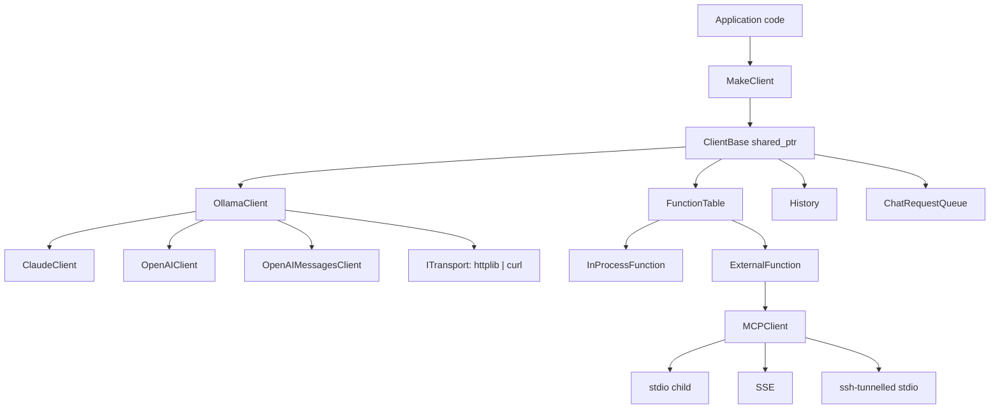

# Assistant Library

`assistant` is a C++20 library for building provider-neutral AI assistants and agent-style applications. It exposes a single `ClientBase` runtime API over multiple LLM providers, with first-class support for streaming, tool/function calling, conversation history, MCP-backed external tools, and **automatic server-side context compaction** for long-running conversations.

## Table of Contents

1. [Highlights](#highlights)
2. [Supported clients and feature matrix](#supported-clients-and-feature-matrix)
3. [Architecture](#architecture)
4. [Quick start](#quick-start)
5. [Configuration](#configuration)
6. [Server-side compaction](#server-side-compaction)
7. [Tool / function calling](#tool--function-calling)
8. [MCP integration](#mcp-integration)
9. [Building and testing](#building-and-testing)
10. [Project layout](#project-layout)
11. [API surface](#api-surface)
12. [Logging](#logging)
13. [Thread safety](#thread-safety)
14. [License and contributing](#license-and-contributing)

## Highlights

- **One unified API over four providers**: Anthropic Claude, OpenAI (`/v1/responses`), OpenAI-compatible chat completions (e.g. Moonshot AI), and Ollama (local or cloud).
- **Streaming responses** with structured callbacks (text, thinking, tool calls, cost, compaction notices, errors).
- **Automatic server-side compaction** for both Claude (beta `compact-2026-01-12`) and OpenAI (`/v1/responses` `context_management`). Long conversations stay focused without manual history surgery.
- **In-process and MCP tools** registered through the same `FunctionTable`. MCP servers can run locally (stdio), over SSE, or remotely via SSH-tunnelled stdio.
- **Per-tool and client-wide human-in-the-loop** approval gates.
- **Cost / usage tracking** with a built-in pricing table for current Claude and GPT-5 model families, plus `AddPricing(...)` for custom rates.
- **Thread-safe** state with Clang `-Wthread-safety` annotations enforced repo-wide.
- **Configuration-driven**, with `${VAR}` environment-variable expansion in every string.
- **Two HTTP transports**: vendored `cpp-httplib` (default) or shelling out to the system `curl` binary for environments where TLS / proxy fidelity matters.

## Supported clients and feature matrix

| Capability                              | `OllamaClient` (Ollama)        | `ClaudeClient` (Anthropic)            | `OpenAIClient` (`/v1/responses`)              | `OpenAIMessagesClient` (`/v1/chat/completions` — Moonshot AI etc.) |
|----------------------------------------|--------------------------------|---------------------------------------|-----------------------------------------------|--------------------------------------------------------------------|
| Wire-format / endpoint                 | `/api/chat`, `/api/show`, `/api/tags` | `/v1/messages`                  | `/v1/responses`                                | `/v1/chat/completions`                                             |
| Streaming                              | Optional (config / model)      | Optional                              | **Forced on** (`IsStreaming() == true`)        | **Forced on** (`IsStreaming() == true`)                            |
| Tool / function calling                | Per-model capability           | Yes                                   | Yes (strict mode, all params required)         | Yes (Ollama-shaped tool schema)                                    |
| Extended thinking                      | Per-model (`<think>` tags)     | Yes (signed thinking blocks)          | Reported as text                               | Per-model                                                          |
| Vision                                 | Per-model                      | No (this lib)                         | No (this lib)                                  | No (this lib)                                                      |
| `CachePolicy::kStatic` (prompt cache)  | n/a                            | `cache_control: {type: ephemeral}` on last tool / system | n/a                            | n/a                                                                |
| **Server-side compaction**             | n/a                            | **Beta (`compact-2026-01-12`), opt-in via `server_compaction.enabled`** | **Always on** (`context_management.compaction`, `compact_threshold`) | n/a                                                                |
| `pause_after_compaction` (single-turn pause) | n/a                       | Yes (surfaces `Reason::kServerCompaction`) | n/a                                       | n/a                                                                |
| Custom compaction summarisation prompt | n/a                            | Yes (`server_compaction.instructions`)  | No                                            | n/a                                                                |
| `Interrupt()` mid-stream               | Yes                            | Yes                                   | Yes                                            | Yes                                                                |
| Cost / usage tracking                  | Yes (when pricing is set)      | Yes (`Usage::FromClaudeJson`)         | Yes                                            | Yes                                                                |
| Human-in-the-loop tool approval        | Yes                            | Yes                                   | Yes                                            | Yes                                                                |
| MCP-backed external tools              | Yes                            | Yes                                   | Yes                                            | Yes                                                                |
| `httplib` transport                    | Default                        | Default                               | Default                                        | Default                                                            |
| `curl` transport                       | Yes                            | Yes                                   | Yes                                            | Yes                                                                |

`MakeClient(...)` selects the concrete client by `Endpoint::type_`:

| `EndpointKind`        | Constructed client          |
|-----------------------|------------------------------|
| `ollama`              | `OllamaClient`               |
| `anthropic`           | `ClaudeClient`               |
| `openai`              | `OpenAIClient`               |
| `moonshotai`          | `OpenAIMessagesClient`       |

## Architecture



`OllamaClient` is the neutral baseline; the OpenAI and Claude clients inherit from it and override only the parts of the request / response lifecycle that differ (system message handling, tool result encoding, streaming framing, compaction semantics).

## Quick start

### Minimal example

```cpp
#include "assistant/assistant.hpp"
#include <iostream>

int main() {
  auto parsed = assistant::ConfigBuilder::FromFile("config.json");
  if (!parsed.ok()) {
    std::cerr << "config: " << parsed.errmsg_ << "\n";
    return 1;
  }

  auto cli_opt = assistant::MakeClient(parsed.config_.value());
  if (!cli_opt) {
    std::cerr << "failed to create client\n";
    return 1;
  }
  auto cli = cli_opt.value();

  cli->AddSystemMessage("You are a precise C++ assistant.");

  cli->Chat(
      "Summarise the SOLID principles in two sentences.",
      [](const std::string& text, assistant::Reason reason, bool thinking) {
        switch (reason) {
          case assistant::Reason::kPartialResult:
            std::cout << text << std::flush;
            break;
          case assistant::Reason::kServerCompaction:
            std::cerr << "\n[compaction] " << text << "\n";
            break;
          case assistant::Reason::kRequestCost:
            std::cerr << "\n[cost] " << text << "\n";
            break;
          case assistant::Reason::kDone:
            std::cout << "\n";
            break;
          case assistant::Reason::kFatalError:
            std::cerr << "[error] " << text << "\n";
            return false;
          default:
            break;
        }
        return true;
      },
      assistant::ChatOptions::kDefault);
}
```

### Minimal configuration

```json
{
  "endpoints": {
    "https://api.anthropic.com": {
      "type": "anthropic",
      "model": "claude-sonnet-4-6",
      "active": true,
      "http_headers": { "x-api-key": "${ANTHROPIC_API_KEY}" },
      "max_tokens": 8192,
      "context_size": 200000
    }
  },
  "log_level": "info",
  "stream": true,
  "keep_alive": "5m"
}
```

`MakeClient` always calls `ApplyConfig(...)` on the constructed client, so MCP servers, log level, timeouts, and compaction thresholds are wired up before the caller receives the pointer.

## Configuration

Configuration is JSON, parsed by `assistant::ConfigBuilder::FromFile(path, env_map?)` or `FromContent(json_str, env_map?)`. Every string is processed by the `EnvExpander` first — `${VAR}` and `$VAR` references are resolved against the optional `EnvMap` overlay, then the process environment.

### Top-level fields

| Field                | Type    | Default    | Notes                                                                 |
|----------------------|---------|------------|-----------------------------------------------------------------------|
| `endpoints`          | object  | required   | Object keyed by URL; each value is an endpoint config (see below)     |
| `mcp_servers`        | object  | `{}`       | Object keyed by server name; each value declares an MCP server        |
| `log_level`          | string  | `"info"`   | One of `trace`/`debug`/`info`/`warn`/`error`                          |
| `stream`             | bool    | `true`     | Default streaming behaviour (OpenAI clients always stream regardless) |
| `keep_alive`         | string  | `"5m"`     | Forwarded to Ollama; ignored elsewhere                                |
| `server_timeout`     | object  | see below  | `connect_msecs` / `read_msecs` / `write_msecs`                        |

### Endpoint fields

| Field                  | Type   | Default     | Notes                                                                                                                              |
|------------------------|--------|-------------|------------------------------------------------------------------------------------------------------------------------------------|
| `type`                 | string | required    | One of `ollama`, `anthropic`, `openai`, `moonshotai`                                                                               |
| `model`                | string | required    | Default model id used for `Chat(...)`                                                                                              |
| `models`               | array  | —           | Optional list of acceptable models for the endpoint                                                                                |
| `active`               | bool   | `false`     | Exactly one endpoint should be `true`; otherwise the first one wins                                                                |
| `http_headers`         | object | `{}`        | Additional HTTP headers (`x-api-key`, `Authorization`, etc.)                                                                       |
| `max_tokens`           | int    | `64000`     | Upper bound on generated tokens (also accepts `max_output_tokens`, `max_completion_tokens` aliases)                                |
| `context_size`         | int    | `32 * 1024` | Total context window for usage / budget reporting                                                                                  |
| `verify_server_ssl`    | bool   | `true`      | Disable to skip server certificate validation (only when built with OpenSSL)                                                       |
| `transport`            | string | `httplib`   | `httplib` or `curl`                                                                                                                |
| `compaction_threshold` | int    | `context_size / 2` | OpenAI `/v1/responses` automatic compaction threshold (input tokens). Falls back to `kDefaultCompactionThreshold = 10000`. |
| `server_compaction`    | object | disabled    | **Anthropic-only**. See [Server-side compaction](#server-side-compaction) below.                                                   |

### Example: full Anthropic endpoint with server-side compaction

```json
{
  "endpoints": {
    "https://api.anthropic.com": {
      "type": "anthropic",
      "model": "claude-opus-4-7",
      "active": true,
      "http_headers": { "x-api-key": "${ANTHROPIC_API_KEY}" },
      "max_tokens": 8192,
      "context_size": 200000,
      "server_compaction": {
        "enabled": true,
        "trigger_input_tokens": 100000,
        "pause_after_compaction": false,
        "instructions": "Preserve code blocks, function names, and TODOs."
      }
    }
  },
  "log_level": "info",
  "stream": true
}
```

### Example: OpenAI `/v1/responses` (compaction is built-in)

```json
{
  "endpoints": {
    "https://api.openai.com": {
      "type": "openai",
      "model": "gpt-5-codex",
      "active": true,
      "http_headers": { "Authorization": "Bearer ${OPENAI_API_KEY}" },
      "context_size": 32768,
      "compaction_threshold": 16000
    }
  },
  "stream": true
}
```

### Example: MCP servers

```json
{
  "mcp_servers": {
    "filesystem": {
      "type": "stdio",
      "enabled": true,
      "command": ["npx", "-y", "@modelcontextprotocol/server-filesystem", "/tmp"]
    },
    "internal-api": {
      "type": "sse",
      "enabled": true,
      "baseurl": "https://mcp.internal/api",
      "endpoint": "/sse",
      "auth_token": "${MCP_TOKEN}"
    },
    "remote-tools": {
      "type": "stdio",
      "enabled": true,
      "command": ["python3", "/opt/mcp/server.py"],
      "ssh": {
        "hostname": "build-host.example.com",
        "user": "${SSH_USER}",
        "port": 22,
        "key": "/home/me/.ssh/id_ed25519"
      }
    }
  }
}
```

## Server-side compaction

Long conversations and agentic tool loops blow past the context window quickly. Both Claude and OpenAI now offer **server-side compaction**: instead of you manually trimming history, the provider summarises older content in-place once a token threshold is reached and the model continues from the summary. This library exposes both behaviours through the same `Reason::kServerCompaction` callback so applications can stay agnostic.

### Side-by-side overview

| Aspect                          | `ClaudeClient`                                                       | `OpenAIClient` (`/v1/responses`)                              |
|---------------------------------|-----------------------------------------------------------------------|----------------------------------------------------------------|
| Status                          | Anthropic beta — gated by `anthropic-beta: compact-2026-01-12`        | Generally available on `/v1/responses`                         |
| Opt-in                          | `endpoints[*].server_compaction.enabled = true`                       | Always-on; tune `endpoints[*].compaction_threshold` only       |
| Wire format                     | `context_management.edits = [{ "type": "compact_20260112", ... }]`    | `context_management = [{ "type": "compaction", "compact_threshold": N }]` |
| Trigger threshold               | `trigger_input_tokens` (default 150,000; min 50,000 server-side)      | `compact_threshold` (defaults to `context_size / 2`, fallback 10,000) |
| Custom summarisation prompt     | `instructions` (replaces the Anthropic default; do not append)        | Not configurable                                               |
| Streaming surface               | New `compaction` content block + `compaction_delta`; optional `stop_reason: "compaction"` when `pause_after_compaction` is true | `response.compaction` SSE event with the new compacted history |
| Local history effect            | A structured `compaction` block is appended to the assistant message; future requests benefit because Anthropic drops everything before the most recent compaction block | Local history is **replaced** with the server's compacted output |
| Callback delivery               | `OnResponseCallback(summary, Reason::kServerCompaction, false)`        | `OnResponseCallback("History has been updated...", Reason::kServerCompaction, false)` |
| Max-token continuation pattern  | Reuse the existing `Reason::kMaxTokensReached` recipe; for `pause_after_compaction=true` re-issue the chat after appending the block | n/a (handled fully server-side)                                |

### Claude (Anthropic)

When `server_compaction.enabled` is `true` on the active Anthropic endpoint, `ClaudeClient`:

1. Adds the beta header `anthropic-beta: compact-2026-01-12` to every `/v1/messages` request. If the operator already configured an `anthropic-beta` value (for other betas), the token is appended comma-separated and de-duplicated.
2. Adds `context_management.edits = [{ "type": "compact_20260112", "trigger": { "type": "input_tokens", "value": <N> }, "pause_after_compaction": <bool>, "instructions": "..." }]` to the request body. Fields that aren't set are omitted.
3. Parses the new `compaction` content block (a single-shot `content_block_delta` with `delta.type: "compaction_delta"` carrying the full summary in `delta.content`) and surfaces it via `Reason::kServerCompaction`.
4. Persists the compaction block as a structured array in the assistant message — `[{ "type": "compaction", "content": "..." }, { "type": "text", "text": "..." }]` — so subsequent requests automatically benefit (the API drops everything before the most recent compaction block on its side).

`pause_after_compaction: true` produces a response that contains *only* the compaction block, with `stop_reason: "compaction"`. The client surfaces this through `Reason::kServerCompaction` with `is_done == true` (mirroring the existing `kMaxTokensReached` continuation pattern); the application decides whether to re-issue the next prompt.

> Note: `usage.iterations` (separate billing for the compaction step itself) is not yet aggregated — the library tracks the top-level `input_tokens` / `output_tokens` only, which match the non-compaction iteration.

### OpenAI (`/v1/responses`)

OpenAI's `context_management.compaction` is **always enabled** on `OpenAIClient` — the request body unconditionally carries:

```json
"context_management": [
  { "type": "compaction", "compact_threshold": <compaction_threshold> }
]
```

When the server emits a `response.compaction` SSE event, the client:

1. Replaces the local `History` with the compacted output (`m_history.ClearAll()` + a single message containing the new structured content).
2. Notifies the application via `Reason::kServerCompaction` with the message *"History has been updated with server-side history compaction."*.

Tune the threshold via the endpoint's `compaction_threshold` (default `context_size / 2`, falling back to `kDefaultCompactionThreshold = 10000`).

### Application handling

Both clients deliver the same callback contract, so the application code is uniform:

```cpp
client->Chat(prompt,
  [](const std::string& text, assistant::Reason reason, bool thinking) {
    if (reason == assistant::Reason::kServerCompaction) {
      // Inform the operator. Optionally persist `text` (the summary) to logs.
      std::cerr << "[compaction] " << text << "\n";
      return true;  // keep streaming the rest of the turn
    }
    // ... handle kPartialResult / kDone / kRequestCost / kMaxTokensReached / ...
    return true;
  },
  assistant::ChatOptions::kDefault);
```

## Tool / function calling

Tools are registered on `client->GetFunctionTable()`. The same `FunctionTable` accepts both in-process C++ callbacks and `ExternalFunction`s wrapped around MCP tools.

```cpp
using assistant::FunctionBuilder;
using assistant::FunctionResult;
using assistant::json;

client->GetFunctionTable().Add(
    FunctionBuilder("Read_file_content_from_a_given_path")
        .SetDescription("Read up to N lines of a file starting at line L.")
        .AddRequiredParam("filepath", "absolute file path", "string")
        .AddRequiredParam("start_line", "1-based start line", "number")
        .AddRequiredParam("count",      "number of lines to read", "number")
        .AddMinMaxValidation("count", 1, 5)
        .SetCallback([](const json& args) -> FunctionResult {
            // ... implement read ...
            return FunctionResult{.text = "<file contents>"};
        })
        .SetHumanInTheLoopCallback(
            [](const std::string& tool_name, json args) {
                return assistant::CanInvokeToolResult{ .can_invoke = true };
            })
        .Build());
```

Per-endpoint serialisation:

| Endpoint   | Wire shape                                                                                         |
|------------|----------------------------------------------------------------------------------------------------|
| Ollama     | `{"type":"function","function":{"name":...,"parameters":{...}}}` with explicit `required` array    |
| Moonshot   | Same as Ollama                                                                                     |
| OpenAI     | Flat `{"type":"function","name":...,"strict":true,"parameters":{...,"additionalProperties":false}}` — strict mode requires every param in `required` and widens optional types to `["<type>","null"]` |
| Anthropic  | `{"name":...,"input_schema":{...}}`; under `CachePolicy::kStatic` the **last** tool gets `cache_control: {type: "ephemeral"}` |

Approval gates have two levels:

- **Per-tool**: `FunctionBuilder::SetHumanInTheLoopCallback(...)` overrides the client-wide one for that specific tool.
- **Client-wide**: `client->SetToolInvokeCallback(OnToolInvokeCallback)` — falls through when a tool has no per-tool callback.

```cpp
using OnToolInvokeCallback =
    std::function<assistant::CanInvokeToolResult(const std::string& tool_name,
                                                 assistant::json args)>;

client->SetToolInvokeCallback([](const std::string& name, assistant::json args) {
  std::cout << "Allow " << name << " (" << args.dump() << ")? [y/n] ";
  std::string answer; std::getline(std::cin, answer);
  return assistant::CanInvokeToolResult{
      .can_invoke = answer == "y",
      .reason = answer == "y" ? "" : "denied by operator"
  };
});
```

## MCP integration

MCP servers declared in `mcp_servers` are instantiated automatically by `ApplyConfig(...)`. For programmatic use:

```cpp
#include "assistant/mcp.hpp"

// Local stdio
auto mcp = std::make_shared<assistant::MCPClient>(
    std::vector<std::string>{
        "npx", "-y", "@modelcontextprotocol/server-filesystem", "/tmp"});

// SSE
auto mcp_sse = std::make_shared<assistant::MCPClient>(
    "https://mcp.internal/api", "/sse", /*auth_token=*/"...",
    std::vector<std::pair<std::string, std::string>>{{"X-Tenant", "team-a"}});

// Remote stdio over SSH
assistant::SSHLogin login{
    .ssh_program = "ssh", .user = "ci", .hostname = "build.example.com",
    .port = 22, .ssh_key = "/home/me/.ssh/id_ed25519"};
auto mcp_remote = std::make_shared<assistant::MCPClient>(
    login, std::vector<std::string>{"python3", "/opt/mcp/server.py"});

client->GetFunctionTable().AddMCPServer(mcp);
```

## Building and testing

The project ships two build directories by convention: `.build-debug/` and `.build-release/`.

### Release (matches CI)

```bash
mkdir -p .build-release && cd .build-release
cmake .. -DCMAKE_BUILD_TYPE=Release -DENABLE_TESTS=ON
cmake --build . --parallel
ctest --output-on-failure
```

### Debug

```bash
mkdir -p .build-debug && cd .build-debug
cmake .. -DCMAKE_BUILD_TYPE=Debug -DENABLE_TESTS=ON
cmake --build . --parallel
```

### CMake options

| Option                      | Default | Effect                                                                                          |
|-----------------------------|---------|-------------------------------------------------------------------------------------------------|
| `ASSISTANTLIB_BUILD_EXAMPLE`| `ON`    | Build the `code-assist` CLI demo from `cli/`                                                    |
| `ASSISTANTLIB_WITH_OPENSSL` | `ON`    | `find_package(OpenSSL)`; defines `CPPHTTPLIB_OPENSSL_SUPPORT=1`; links SSL/Crypto (`Crypt32` on Win) |
| `ASSISTANTLIB_BUILD_TESTS`  | `OFF`   | Build the GoogleTest binaries in `tests/` (also enabled by `ENABLE_TESTS=ON`)                   |
| `ENABLE_TLS`                | unset   | Alias for `ASSISTANTLIB_WITH_OPENSSL=ON`                                                        |
| `ENABLE_TESTS`              | unset   | Alias for `ASSISTANTLIB_BUILD_TESTS=ON`                                                         |

CI runs the full matrix on macOS, Ubuntu, and Windows (MSYS2 `clang64`), with and without OpenSSL.

### Test binaries

`gtest_discover_tests` registers each test individually; you can also run the binaries directly:

```text
test_config            test_config_file
test_env_expander      test_history
test_process           test_claude_response_parser
test_openai_response_parser   test_openai_response_format
test_openai_client     test_openai_messages_client
```

```bash
.build-release/tests/test_claude_response_parser
ctest --test-dir .build-release -R test_config --output-on-failure
```

## Project layout

```
assistant/                core library and public headers
  client/                 ClientBase + Ollama/Claude/OpenAI clients
  cpp-mcp/                MCP protocol implementation (built as `mcp-cpp` static lib)
  common/                 vendored single-header deps (json, httplib, base64, magic_enum)
  *.hpp / *.cpp           assistantlib.hpp, config.hpp, function.hpp, mcp.hpp,
                          claude_response_parser.*, openai_response_parser.*,
                          chat_completions_response_parser.*, EnvExpander.*,
                          Curl.*, Process.*, logger.hpp, ...

cli/                      `code-assist` interactive demo (entry point, slash commands)
tests/                    GoogleTest binaries (10 of them)
submodules/googletest/    test framework (git submodule)
.github/workflows/        macos.yml, ubuntu.yml, windows.yml (msys2 clang64)
.agents/summary/          generated knowledge base for AI assistants
```

The library currently installs no headers and produces no CMake export package. Integrate by `add_subdirectory(assistant)` and `target_link_libraries(... PRIVATE assistantlib)`.

## API surface

### Top-level factory

```cpp
#include "assistant/assistant.hpp"
namespace assistant {
  std::optional<std::shared_ptr<ClientBase>> MakeClient(std::optional<Config>);
  std::optional<std::shared_ptr<ClientBase>> MakeClient(const std::string& json_content);
  std::optional<std::shared_ptr<ClientBase>> MakeClient(const std::filesystem::path&);
}
```

### `ClientBase` (selected methods)

```cpp
// Chat lifecycle
virtual void Chat(std::string msg, OnResponseCallback cb, ChatOptions opts) = 0;
virtual void Interrupt();
virtual void Shutdown();
bool IsInterrupted() const;

// Models
virtual bool IsRunning() = 0;
virtual std::vector<std::string> List() = 0;
virtual std::optional<json> GetModelInfo(const std::string& model) = 0;
virtual std::optional<ModelCapabilities> GetModelCapabilities(const std::string& model) = 0;

// State
void AddSystemMessage(const std::string& msg);
void ClearSystemMessages();
void ClearHistoryMessages();
assistant::messages GetHistory() const;
void SetHistory(const assistant::messages& msgs);

// Tools
FunctionTable& GetFunctionTable();
void SetToolInvokeCallback(OnToolInvokeCallback cb);

// Endpoint / transport
std::string GetUrl() const;
EndpointKind GetEndpointKind() const;
size_t GetMaxTokens() const;
size_t GetContextSize() const;
size_t GetCompactionThreshold();         // OpenAI compaction threshold
TransportType GetTransportType() const;
void SetTransportType(TransportType);

// Caching
CachePolicy GetCachingPolicy() const;
void SetCachingPolicy(CachePolicy);

// Streaming
virtual bool IsStreaming() const;        // OpenAI clients return true unconditionally

// Cost / usage
std::optional<Pricing> GetPricing() const;
void SetPricing(const Pricing&);
double GetLastRequestCost() const;
double GetTotalCost() const;
std::optional<Usage> GetLastRequestUsage() const;
Usage GetAggregatedUsage() const;
std::optional<TokenUsageStats> GetTokenUsageStats() const;
TokenUsageStats GetAggregatedTokenUsageStats() const;
bool IsNearContextLimit(double threshold_percentage = 80.0) const;
```

### Streaming callback contract

```cpp
using OnResponseCallback = std::function<bool(
    const std::string& text, assistant::Reason call_reason, bool thinking)>;
```

| `Reason`              | When delivered                                                                              |
|-----------------------|---------------------------------------------------------------------------------------------|
| `kPartialResult`      | Streaming text or thinking chunk                                                            |
| `kDone`               | Turn complete                                                                               |
| `kFatalError`         | Non-recoverable error (transport, parse, auth, quota, ...)                                  |
| `kCancelled`          | `Interrupt()` was called mid-stream                                                         |
| `kLogNotice` / `kLogDebug` | Informational messages emitted by the client (tool inputs, etc.)                       |
| `kRequestCost`        | Per-request cost / usage summary string                                                     |
| `kToolDenied` / `kToolAllowed` | Result of a human-in-the-loop tool gate                                            |
| `kMaxTokensReached`   | Hit `max_tokens`; caller may continue with `"continue from where you left off"` etc.        |
| `kServerCompaction`   | Server-side compaction notice (Anthropic summary block, or OpenAI history-replaced notice)  |

Returning `false` from the callback signals "stop processing further chunks for this request"; the CLI demo always returns `true`.

### Chat options and model capabilities

```cpp
enum class ChatOptions { kDefault = 0, kNoTools = 1<<0, kNoHistory = 1<<1 };
enum class ModelCapabilities {
  kNone = 0, kThinking = 1<<0, kTools = 1<<1,
  kCompletion = 1<<2, kInsert = 1<<3, kVision = 1<<4
};
enum class CachePolicy { kNone, kAuto, kStatic };
```

Use `assistant::IsFlagSet(flags, flag)` and `assistant::AddFlagSet(flags, flag)` to manipulate bitflag enums.

### Pricing

```cpp
auto pricing = assistant::FindPricing("claude-sonnet-4-6");
if (pricing) client->SetPricing(*pricing);

// Or register custom rates (USD per token)
assistant::AddPricing("my-model",
                     {.input_tokens = 0.000003,
                      .cache_creation_input_tokens = 0.00000375,
                      .cache_read_input_tokens     = 0.0000003,
                      .output_tokens               = 0.000015});
```

## Logging

```cpp
#include "assistant/logger.hpp"
assistant::SetLogLevel(assistant::LogLevel::kInfo);
assistant::SetLogFile("/tmp/assistant.log");
assistant::SetLogSink([](assistant::LogLevel, std::string line) {
  // forward to your application log
});
OLOG_INFO()  << "structured " << "stream " << 42;
OLOG_DEBUG() << "...";
OLOG_ERROR() << "...";
```

`Logger::FromString("trace"|"debug"|"info"|"warn"|"error")` parses a config string; unknown values default to `kInfo`.

## Thread safety

All shared client state is guarded:

- `Locker<T>` (`assistant/common.hpp`) wraps mutable fields and only exposes `with`/`with_mut`/`get_value`/`set_value`.
- `History`, `ChatRequestQueue`, and `FunctionTable` use internal mutexes; `GUARDED_BY(...)` annotations from `assistant/attributes.hpp` are enforced repo-wide via Clang `-Wthread-safety`.
- `m_interrupt` is a plain `std::atomic_bool`; calling `Interrupt()` from another thread is safe and aborts the in-flight transport.
- `History::SwapToTempHistory()` / `SwapToMainHistory()` is the supported way to issue a one-off chat turn (`ChatOptions::kNoHistory`) without disturbing the main log.

A typical embedding pattern: one application thread drives `Chat(...)`, while a worker thread handles streaming callbacks; both can safely interact with the client.

## License and contributing

See [LICENSE](LICENSE) for license terms.

Contributions are welcome. To keep the bar high:

- Match the existing style — `.clang-format` is `Google` with 2-space indent and 80-col wrap; the project ships a `.cmake-format` too.
- Build clean on macOS, Ubuntu, and Windows MSYS2 `clang64` (CI matrix).
- Add or extend GoogleTest binaries for new behaviours, especially in the response parsers and config loader.
- Update `.agents/summary/` (or open an issue) when behaviour drifts from those docs.
